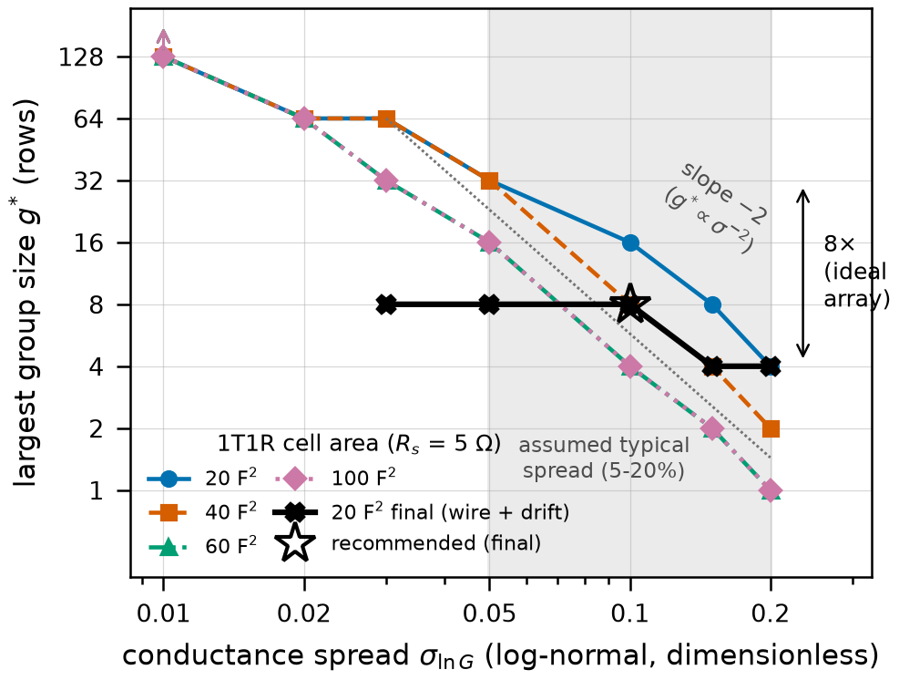
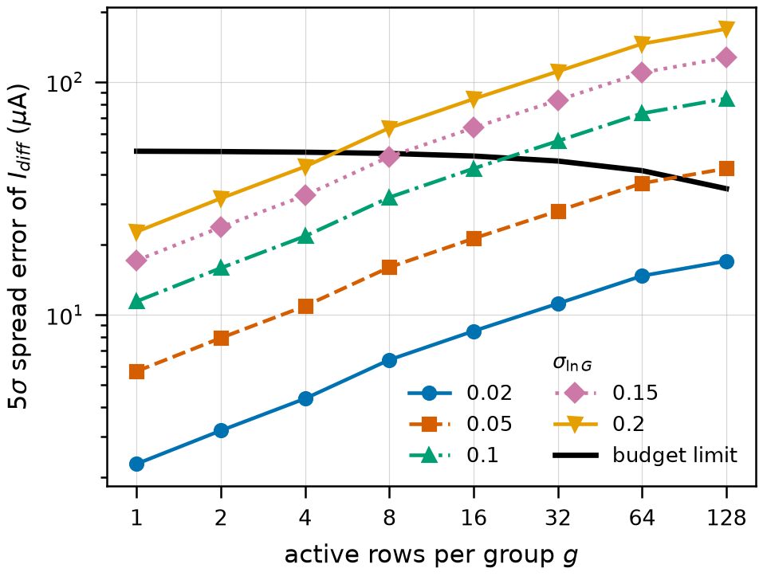
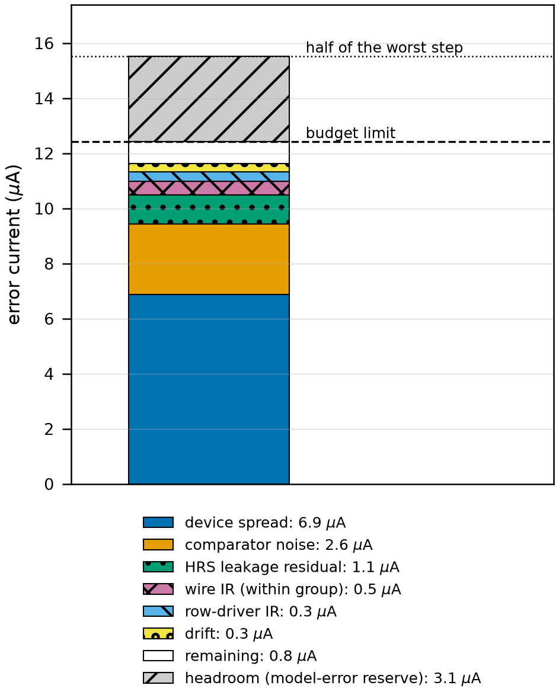
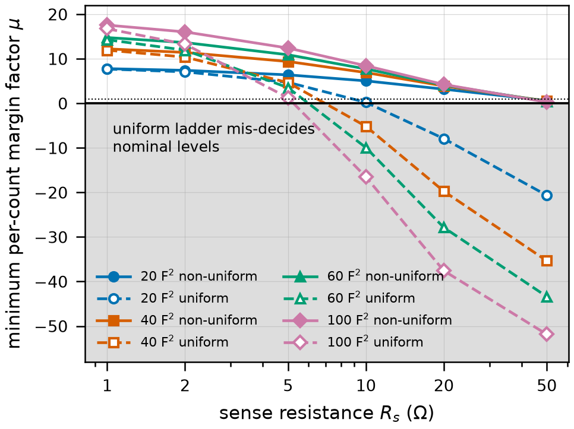
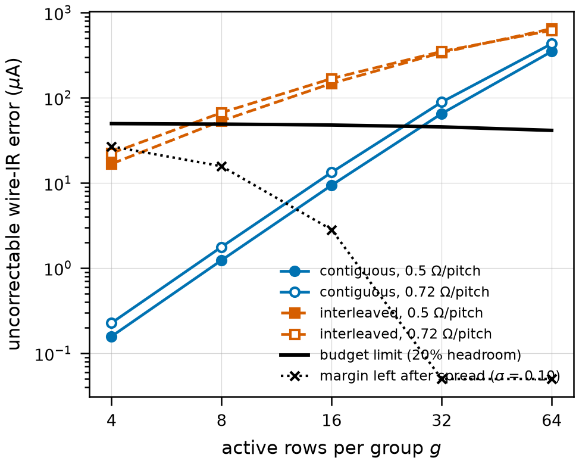
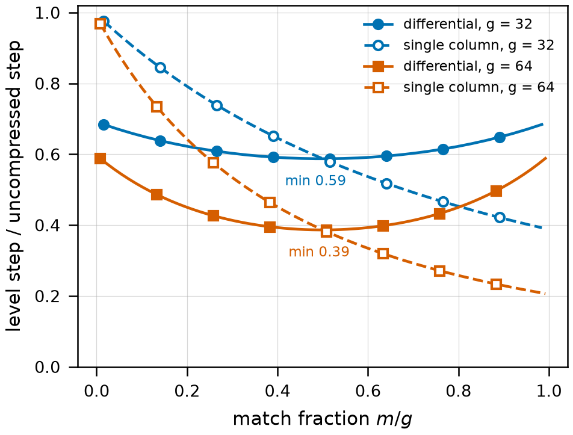

# Phase 1B report - the margin budget, wire IR, drift, and the final g

Consolidated report for all of sub-phase 1B. The earlier `results/reports/phase1b_provisional_report.md` (1B-i) stays on disk; this is the document to read. Tags: **[SIM]** simulated (ngspice or the validated solvers),
**[MODEL]** analytic in code, **[ASSUM]** assumed/literature, **[CHOICE]** design decision, **[SP]** Stanford-PKU default.

## 0. The answer

- **Final g = 8 rows per group** at the recommended operating point **20 F^2 cell (2T2R cell = 40 F^2, pitch 0.201 um), R_s = 1 ohm (current-mode sense), contiguous groups, 32-column macros**, for
  sigma_lnG = 0.10, wire 0.72 ohm/pitch, drift 'moderate' (nu = 0.003), drift strategy **S1**. The 1B-i provisional value was 16.
- **g* by sigma** (same cell): 8 at 0.03, 8 at 0.05, 8 at 0.1, 4 at 0.15, 4 at 0.2. Reads per timestep at g = 8: **5,632** (88 x 512/g) or **704** (11 x 512/g if all 160 columns sense at once); **563,200** per inference in the first case.
- **Margin left at the final point: 6% of the limit (0.8 uA of 12.4)** - **MARGINAL / FRAGILE**: it is inside about twice the 2-3% Monte-Carlo error, so g = 8 could equally come out as 4. The surface is robust to R_s and to moderate drift (sections 1.1-1.2) but not to comparator noise: at 3 uA (1 sigma) g* falls to 4 (section 1.3).
- **The recommendation is CONDITIONAL on 1D's SET current**: 20 F^2 passes only ~280 uA of ideal drive (1A). If 1D needs more, the fallback is 40 F^2: g* = 4 at sigma 0.10 instead of 8 (section 1.1).
- **What limits the design** (section 2): device spread at 5 sigma sets g for sigma >= 0.10 (24 of 24 cells at 0.10, 24 at 0.15). For sigma <= 0.05 the far group takes over: its bitline is 252-364 ohm of series resistance, which compresses its step to ~34 uA, and the comparator noise (the 'abs.signal' term) then binds (18 of 24 cells at 0.03, 6 at 0.05). **The 1B-i claim that spread binds everywhere does not survive the wire**: tightening sigma below ~0.10 buys nothing at g = 8 unless the far-group compression is fixed (sense node in the column middle: g* 16, section 1.3). The row line caps a macro at 32 columns. sigma_lnG still sets g for sigma >= 0.10, and 1D's program-verify is the lever on it.

## 1. The final g surface

### 1.1 Surface over (R_s, cell area, sigma_lnG)

Largest g whose budget closes at BOTH extreme groups (near and far) with wire IR and drift included, and whose CMRR is achievable (60 dB [ASSUM]). Labels: spread = device spread, abs.signal = comparator noise, HRS leak, wire IR (within-group),
row IR (row-driver, weight dependent), ref cells, drift, CMRR, grid = still ok at the top of the evaluated grid.

**sigma_lnG = 0.03** (g*, limiter of the next g) - wire 0.72 ohm/pitch, drift 'moderate'

| cell area (F^2) \ R_s (ohm) | 1 | 2 | 5 | 10 | 20 | 50 |
|---|---|---|---|---|---|---|
| 20 | 8 (abs.signal) | 8 (abs.signal) | 8 (abs.signal) | 8 (abs.signal) | 8 (abs.signal) | 8 (abs.signal) |
| 40 | 8 (abs.signal) | 8 (abs.signal) | 8 (abs.signal) | 8 (abs.signal) | 8 (abs.signal) | 8 (abs.signal) |
| 60 | 8 (abs.signal) | 8 (abs.signal) | 8 (abs.signal) | 8 (abs.signal) | 8 (abs.signal) | 8 (abs.signal) |
| 100 | 4 (spread) | 4 (spread) | 4 (spread) | 4 (spread) | 4 (spread) | 4 (spread) |

**sigma_lnG = 0.05** (g*, limiter of the next g) - wire 0.72 ohm/pitch, drift 'moderate'

| cell area (F^2) \ R_s (ohm) | 1 | 2 | 5 | 10 | 20 | 50 |
|---|---|---|---|---|---|---|
| 20 | 8 (abs.signal) | 8 (abs.signal) | 8 (abs.signal) | 8 (abs.signal) | 8 (abs.signal) | 8 (abs.signal) |
| 40 | 8 (spread) | 8 (spread) | 8 (spread) | 8 (spread) | 8 (spread) | 8 (spread) |
| 60 | 4 (spread) | 4 (spread) | 4 (spread) | 4 (spread) | 4 (spread) | 4 (spread) |
| 100 | 4 (spread) | 4 (spread) | 4 (spread) | 4 (spread) | 4 (spread) | 4 (spread) |

**sigma_lnG = 0.1** (g*, limiter of the next g) - wire 0.72 ohm/pitch, drift 'moderate'

| cell area (F^2) \ R_s (ohm) | 1 | 2 | 5 | 10 | 20 | 50 |
|---|---|---|---|---|---|---|
| 20 | 8 (spread) | 8 (spread) | 8 (spread) | 8 (spread) | 8 (spread) | 8 (spread) |
| 40 | 4 (spread) | 4 (spread) | 4 (spread) | 4 (spread) | 4 (spread) | 4 (spread) |
| 60 | 4 (spread) | 4 (spread) | 4 (spread) | 4 (spread) | 4 (spread) | 4 (spread) |
| 100 | 2 (spread) | 2 (spread) | 2 (spread) | 2 (spread) | 2 (spread) | 2 (spread) |

**sigma_lnG = 0.15** (g*, limiter of the next g) - wire 0.72 ohm/pitch, drift 'moderate'

| cell area (F^2) \ R_s (ohm) | 1 | 2 | 5 | 10 | 20 | 50 |
|---|---|---|---|---|---|---|
| 20 | 4 (spread) | 4 (spread) | 4 (spread) | 4 (spread) | 4 (spread) | 4 (spread) |
| 40 | 2 (spread) | 2 (spread) | 2 (spread) | 2 (spread) | 2 (spread) | 2 (spread) |
| 60 | 2 (spread) | 2 (spread) | 2 (spread) | 2 (spread) | 2 (spread) | 2 (spread) |
| 100 | 1 (spread) | 1 (spread) | 1 (spread) | 1 (spread) | 1 (spread) | 1 (spread) |

**sigma_lnG = 0.2** (g*, limiter of the next g) - wire 0.72 ohm/pitch, drift 'moderate'

| cell area (F^2) \ R_s (ohm) | 1 | 2 | 5 | 10 | 20 | 50 |
|---|---|---|---|---|---|---|
| 20 | 4 (spread) | 4 (spread) | 4 (spread) | 4 (spread) | 4 (spread) | 4 (spread) |
| 40 | 1 (spread) | 1 (spread) | 1 (spread) | 1 (spread) | 1 (spread) | 2 (spread) |
| 60 | 1 (spread) | 1 (spread) | 1 (spread) | 1 (spread) | 1 (spread) | 1 (spread) |
| 100 | 1 (spread) | 1 (spread) | 1 (spread) | 1 (spread) | 1 (spread) | 1 (spread) |

**Binding-term map** (cells of the 24 (area, R_s) whose next-larger g is limited by each term):

| sigma_lnG | limiter |
|---|---|
| 0.03 | abs.signal: 18, spread: 6 (of 24) |
| 0.05 | abs.signal: 6, spread: 18 (of 24) |
| 0.1 | spread: 24 (of 24) |
| 0.15 | spread: 24 (of 24) |
| 0.2 | spread: 24 (of 24) |

### 1.2 Sensitivity to the unmeasured wire and drift parameters (recommended cell)

| drift scenario | nu | wire ohm/pitch | g* at sigma 0.03 | g* at sigma 0.05 | g* at sigma 0.1 | g* at sigma 0.15 | g* at sigma 0.2 |
|---|---|---|---|---|---|---|---|
| none | 0 | 0.5 | 8 | 8 | 8 | 4 | 4 |
| none | 0 | 0.72 | 8 | 8 | 8 | 4 | 4 |
| moderate | 0.003 | 0.5 | 8 | 8 | 8 | 4 | 4 |
| moderate | 0.003 | 0.72 | 8 | 8 | 8 | 4 | 4 |
| strong | 0.01 | 0.5 | 8 | 8 | 8 | 4 | 2 |
| strong | 0.01 | 0.72 | 8 | 8 | 4 | 4 | 2 |

### 1.3 Layout and front-end levers (how fragile is the final g?)

On the final budget at the recommended cell (S1, drift 'moderate', 0.72 ohm/pitch): what changes g*.

| lever | g* at sigma 0.03 | 0.05 | 0.10 | 0.15 |
|---|---|---|---|---|
| baseline | 8 (abs.signal) | 8 (abs.signal) | 8 (spread) | 4 (spread) |
| sense node in the column middle | 16 (wire IR) | 16 (wire IR) | 8 (spread) | 4 (spread) |
| comparator 0.3 uA (1 sigma) | 8 (spread) | 8 (spread) | 8 (spread) | 4 (spread) |
| both | 16 (wire IR) | 16 (wire IR) | 8 (spread) | 4 (spread) |
| comparator 3 uA | 4 (abs.signal) | 4 (abs.signal) | 4 (abs.signal) | 2 (abs.signal) |

### 1.4 How much g moved from 1B-i

| sigma_lnG | 1B-i provisional g* (20 F^2, R_s 1) | final g* | grid steps down |
|---|---|---|---|
| 0.05 | 32 | 8 | 2 step(s) |
| 0.1 | 16 | 8 | 1 step(s) |
| 0.15 | 4 | 4 | - step(s) |
| 0.2 | 4 | 4 | - step(s) |

Over the whole grid (sigma 0.05-0.20, 96 cells): | grid steps g fell (1B-i -> final) | cells (of 96) |
|---|---|
| 0 | 34 |
| 1 | 40 |
| 2 | 22 |

(1B-i values in the first table are the provisional ones: wire IR and drift were not in the budget.)

## 2. What binds, and what the map says about where the design is limited

| sigma_lnG | limiter |
|---|---|
| 0.03 | abs.signal: 18, spread: 6 (of 24) |
| 0.05 | abs.signal: 6, spread: 18 (of 24) |
| 0.1 | spread: 24 (of 24) |
| 0.15 | spread: 24 (of 24) |
| 0.2 | spread: 24 (of 24) |

Reading the map: the limiter is **device spread** for every cell at sigma >= 0.10, which is the 1B-i result. Below that the limiter becomes the **absolute signal** (comparator noise against the far group's compressed step), because the far group sits behind
252-364 ohm of bitline (0.5-0.72 ohm/pitch): that is exactly a larger sense resistor for that group, so its step is 34-46 uA instead of 123 uA at g = 8 (section 7.1/7.3), and the 5 uA (5 sigma) comparator term is a large share of its
13.6-18.5 uA limit. **Wire IR as the uncorrectable within-group term (near group) is not the limiter at the recommended point** - it appears as the limiter only when the far-group problem is removed (sense node in the middle: g* 16 limited by 'wire IR', section 1.3) or at larger g.
So the answer to "does spread still bind everywhere, or does wire take over somewhere" is: spread binds for sigma >= 0.10; at tighter sigma the wire takes over, first through the far group's compression (and the comparator), then through the within-group residual.
CMRR does not decide g* anywhere on this surface: the largest requirement over all 3600 Monte-Carlo-evaluated points is 46.5 dB, below the 60 dB assumed achievable (and 35.9 dB for g <= 8).

## 3. Every term of the budget, measured

Final recommended point, worst group = **far** (20 F^2, R_s 1, g 8, sigma 0.10, wire 0.72 ohm/pitch, drift 'moderate', strategy S1). Delta = 31.0 uA; budget limit (20% headroom) = 12.4 uA;
total error = deterministic terms 1.85 + random terms in quadrature 9.77 (5 sigma) = 11.62 uA; remaining 0.80 uA.

| term | kind | value (uA) | % of worst step Delta |
|---|---|---|---|
| device spread | random | 8.20 | 26.4% |
| comparator noise (absolute signal) | random | 5.00 | 16.1% |
| ReRAM HRS leakage residual | det | 1.06 | 3.4% |
| wire IR, within group | det | 0.49 | 1.6% |
| row-driver IR (weight dependent) | random | 1.83 | 5.9% |
| drift level shift | det | 0.29 | 0.9% |

Terms and how they combine are defined in `solver/budget.py` (1B-i report section 1): compression is NOT a term (it is inside Delta); transistor off-leakage is closed (1A: 77x-998x headroom at 125 C); correctable terms enter only through their residual.
Figure 3 (section 11) shows this stack; the 1B-i version (spread, comparator, HRS residual only) is `fig3_budget_stack.png`.

## 4. Part A - where spread takes over from leakage and compression

The 1B-i grid jumped from sigma = 0 (g* = 128) to 0.05 (g* = 32). Adding sigma = 0.01, 0.02, 0.03 (20 F^2, R_s 5):

| sigma_lnG | g* | limits the next g | 5-sigma spread at g* (uA) | HRS-leak residual at g* (uA) | budget limit (uA) |
|---|---|---|---|---|---|
| 0.0 | 128 | grid | 0.0 | 19.2 | 34.8 |
| 0.01 | 128 | grid | 8.5 | 19.2 | 34.8 |
| 0.02 | 64 | HRS leak | 14.7 | 9.6 | 41.6 |
| 0.03 | 64 | spread | 22.0 | 9.6 | 41.6 |
| 0.05 | 32 | spread | 27.9 | 4.8 | 45.7 |
| 0.1 | 16 | spread | 42.5 | 2.4 | 48.0 |
| 0.15 | 8 | spread | 47.7 | 1.2 | 49.2 |
| 0.2 | 4 | spread | 43.3 | 0.6 | 49.8 |

**Device spread overtakes the HRS-leakage residual as the binding term between sigma = 0.02 and 0.03, where g* is 64.** Analytically, spread and leakage residual are equal at the sigma shown for each g (spread is linear in sigma: spread/sigma varies by < 1% from sigma 0.01 to 0.20):

| g | sigma at which 5-sigma spread = HRS-leak residual | HRS-leak residual (uA) |
|---|---|---|
| 1 | 0.0013 | 0.15 |
| 2 | 0.0019 | 0.30 |
| 4 | 0.0028 | 0.60 |
| 8 | 0.0038 | 1.21 |
| 16 | 0.0057 | 2.41 |
| 32 | 0.0086 | 4.82 |
| 64 | 0.0131 | 9.62 |
| 128 | 0.0226 | 19.17 |

Meaning for 1D (ideal array, no wire): tightening the write below ~2-3% spread buys nothing more - g saturates at 64-128 where HRS leakage, compression and CMRR take over; above 3% every halving of sigma quadruples g. **With bitline wire and drift included the plateau comes much earlier: g* is 8 for every sigma <= 0.10 (sections 1.1, 2)**, so the useful range of write tightening in the final design is sigma 0.20 -> 0.10 (g 4 -> 8), unless the layout lever in section 1.3 is adopted.

## 5. Comparator, ladder and CMRR

- **Ladder** (1B-i section 3, `results/margin_budget/comparator_ladder_recommended.csv`): thresholds on the actual compressed levels, sigma-weighted; one table per active count a; levels antisymmetric so half are stored. It is cheap for a binary readout because a threshold only needs its reference in the right place; an analog readout would need a runtime per-column multiply. The non-uniform ladder is NECESSARY above a g x R_s threshold: the uniform ladder mis-decides nominal levels outright at 34 of 192 sigma = 0 grid points (Figure 4) and is indistinguishable from it at the recommended small-g, small-R_s point.
- **Per-group ladder.** Because the far group's bitline is a series resistance, **every group needs its own ladder** (a per-group, per-(a, m) threshold table, section 7): groups differ in level scale by up to a factor 1.9 (g = 4, farthest group) and 5.0 (g = 16, farthest group).
- **CMRR (independent bound).** Required CMRR = 20 log10(I_cm / (10% x Delta)) at the worst group. At the recommended point it is 31.6 dB at g = 8; the far group's smaller Delta raises it. Achievable CMRR is 60 dB [ASSUM, textbook range 60-80 dB, not verified for this process].

| g | CMRR needed at the worse of the near and far group (dB) | within the 60 dB assumption? |
|---|---|---|
| 2 | 14.9 | yes |
| 4 | 23.0 | yes |
| 8 | 31.6 | yes |
| 16 | 41.1 | yes |

## 6. The current-mode readout conclusion

With a passive sense resistor the step swings Delta x R_s = 0.031 mV at the recommended point (Delta 31.0 uA, R_s 1 ohm), against an uncalibrated comparator offset of ~5 mV (1 sigma) [ASSUM]; 5 sigma is 25 mV.
**Passive voltage sensing is not viable.** The readout must be current-mode / virtual-ground (a transimpedance or current-conveyor front end holding the column near 0 V), with input-referred current resolution of ~1 uA (1 sigma) or better [ASSUM, unsourced]. The "R_s" of the budget is then the effective input resistance of that front end (a few ohms).
Virtual ground also removes the sense-resistor compression, but it does not help the binding terms (spread; wire IR still adds series resistance in the bitline itself).

## 7. Wire resistance

### 7.1 First-order bound (C0), and the regime

Lumped linear estimate (20 F^2, R_s 5; bitline 0.5-0.72 ohm per cell pitch [ASSUM], pitch 0.201 um at 20 F^2; no mesh):

| g | within-group half-range, contiguous (uA, 0.5-0.72 ohm/pitch) | within-group, interleaved (uA) | Delta, no wire (uA) | Delta, farthest group (uA) | bitline series R of the far group (ohm) |
|---|---|---|---|---|---|
| 4 | 0.16 - 0.24 | 20.9 - 30.1 | 124.8 | 72.2 - 59.5 | 254 - 366 |
| 8 | 1.31 - 1.88 | 83.7 - 120.5 | 123.2 | 46.3 - 33.9 | 252 - 364 |
| 16 | 10.46 - 15.07 | 334.8 - 482.1 | 120.2 | 24.0 - 15.5 | 248 - 358 |
| 32 | 83.70 - 120.53 | 1339.2 - 1928.5 | 114.4 | 10.2 - 6.0 | 240 - 346 |
| 64 | 669.62 - 964.25 | 5357.0 - 7714.0 | 104.0 | 3.9 - 2.1 | 224 - 323 |

- **(a) between groups:** the far group sits behind 224-366 ohm of bitline. That is the same as a larger sense resistor for that group: a per-group ladder removes the LEVEL shift, but the compression it causes shrinks the step (g = 16: 120.2 -> 15.5-24.0 uA).
- **(b) within a group:** half the pattern range, which no constant can remove. At g = 16 it is 10.5-15.1 uA against the 2.8 uA that 1B-i left, i.e. **well over: the regime in which g = 8 is already the answer** (g = 8: 1.3-1.9 uA).
  The mesh below confirms this and finds the layout rule; it also shows the first-order estimate is the NEAR-group value (full currents).

### 7.2 The mesh solver and its validation (C1)

`wire/mesh.py`: 2-D mesh (row lines with driver, bitlines with the sense node, sinh cells with the linear R_tx), sparse-LU Newton. Validated against ngspice before use:

| array (rows x cols) | cases | worst |dI_col|/I_col | worst scale-normalised I_diff | max Newton iterations |
|---|---|---|---|---|
| 16 x 8 | 256 | 4.01e-11 | 9.58e-12 | 4 |
| 32 x 8 | 512 | 4.56e-11 | 1.03e-11 | 4 |
| 64 x 16 | 1024 | 4.84e-11 | 1.01e-11 | 4 |

**Worst disagreement over all 1792 cases: 4.84e-11 on column current, 1.03e-11 on scale-normalised I_diff (threshold 1e-04) -> PASS.** Every active count a = 1..R, four activation patterns per count (nearest-to-sense rows, farthest rows, two random subsets), two random 2T2R weight draws with log-normal spread (sigma 0.10), two wire settings (0.72 ohm/pitch with 10 ohm drivers, and an exaggerated 5 ohm/pitch with 100 ohm drivers). ngspice keeps every physical row; the solver collapses runs of inactive rows analytically, so this also validates that elimination. Method: full Newton on all 2nK + K unknowns with the Jacobian solved by sparse LU, step limited to 0.2 V with backtracking, convergence asserted (raises if not converged in 60 iterations).

### 7.3 Decomposition (C2): between-group, within-group, and the contiguity evidence

One 2T2R pair, nominal gaps (spread is a separate term), 40 random activation patterns per (group, a, m) split 50/50 into fit and held-out, plus the near-packed and far-packed extremes. 'Per-group table' = the ladder's level for each (a, m) set to the
fit mean; 'minimax' = set to the middle of the fit-plus-extremes range (the best constant for the worst case).

| g | layout | ohm/pitch | total wire error vs ideal, max (uA) | after per-group table: fit max (uA) | held-out max (uA) | extremal patterns (uA) | WITHIN-group budget term, worst case (uA) | after per-group scalar gain only, held-out max (uA) |
|---|---|---|---|---|---|---|---|---|
| 4 | contiguous | 0.5 | 98.9 | 0.20 | 0.20 | 0.16 | 0.16 | 15.9 |
| 4 | contiguous | 0.72 | 121.2 | 0.25 | 0.25 | 0.23 | 0.23 | 17.9 |
| 4 | interleaved | 0.5 | 58.1 | 20.89 | 20.89 | 16.80 | 16.80 | 16.8 |
| 4 | interleaved | 0.72 | 75.1 | 25.81 | 25.81 | 22.46 | 22.46 | 22.5 |
| 8 | contiguous | 0.5 | 277.6 | 1.31 | 1.31 | 1.24 | 1.24 | 40.2 |
| 8 | contiguous | 0.72 | 320.6 | 1.49 | 1.96 | 1.78 | 1.78 | 40.7 |
| 8 | interleaved | 0.5 | 161.5 | 51.14 | 60.16 | 53.76 | 53.76 | 54.1 |
| 8 | interleaved | 0.72 | 199.9 | 68.48 | 64.30 | 67.08 | 67.08 | 63.3 |
| 16 | contiguous | 0.5 | 687.3 | 8.42 | 7.04 | 9.42 | 9.42 | 84.1 |
| 16 | contiguous | 0.72 | 754.1 | 11.02 | 11.79 | 13.36 | 13.36 | 84.4 |
| 16 | interleaved | 0.5 | 430.4 | 121.48 | 144.97 | 148.09 | 148.09 | 140.1 |
| 16 | interleaved | 0.72 | 506.3 | 157.67 | 142.57 | 168.68 | 168.68 | 160.7 |
| 32 | contiguous | 0.5 | 1514.8 | 38.70 | 39.41 | 65.35 | 65.35 | 165.0 |
| 32 | contiguous | 0.72 | 1602.8 | 52.10 | 55.90 | 89.22 | 89.22 | 170.3 |
| 32 | interleaved | 0.5 | 1042.0 | 224.71 | 248.69 | 339.92 | 339.92 | 284.1 |
| 32 | interleaved | 0.72 | 1168.4 | 253.65 | 251.13 | 351.69 | 351.69 | 254.3 |
| 64 | contiguous | 0.5 | 3003.2 | 157.88 | 152.50 | 351.15 | 351.15 | 310.5 |
| 64 | contiguous | 0.72 | 3108.5 | 235.53 | 191.99 | 432.69 | 432.69 | 284.7 |
| 64 | interleaved | 0.5 | 2238.1 | 395.49 | 373.93 | 650.12 | 650.12 | 407.8 |
| 64 | interleaved | 0.72 | 2422.7 | 344.90 | 377.94 | 621.59 | 621.59 | 419.3 |

Group by group (contiguous, g = 16, 0.72 ohm/pitch):

| group G | physical rows | level-scale (alpha) vs ideal | level shift removed by the per-group table, max (uA) | group step Delta_G (uA) | residual within the group (uA) | rms left by a per-group SCALAR gain (% of before) |
|---|---|---|---|---|---|---|
| 0 | 0-15 | 0.957 | 43.6 | 112.4 | 13.36 | 19% |
| 8 | 128-143 | 0.515 | 469.8 | 53.9 | 6.37 | 12% |
| 16 | 256-271 | 0.342 | 627.2 | 31.0 | 3.72 | 10% |
| 24 | 384-399 | 0.250 | 709.1 | 20.6 | 2.43 | 8% |
| 31 | 496-511 | 0.200 | 754.1 | 15.3 | 1.79 | 7% |

- **Between groups:** the level shift (`level shift removed by the per-group table`) is up to ~700 uA at g = 16 and is removed by the per-group table to the within-group residual: it is a constant per group, compile-time correctable. What it leaves behind is the compression (Delta_G falls from 112.4 to 15.3 uA), which enters the budget through Delta of the far group.
- **Within a group:** the residual is bounded by the group's span and grows ~g^3 (up to g = 16): contiguous layout keeps it to 0.1-0.2 uA (g = 4), 1.2-1.8 (g = 8), 9-13 (g = 16). **Only this term enters the budget** (as a deterministic worst-case, because it is activation dependent).
- **Contiguity rule evidence:** interleaving the same groups across the column costs 15x (g = 16) to 100x (g = 4) more within-group error (Figure 5). The rule is not an assertion: rows of one group must be physically adjacent.
- **The near group is the worst for the within-group term** (largest currents), **the far group for the step** (compression); both are monotone in distance, so the budget is closed at both extremes (checked on 5 probed groups).

### 7.4 The held-out test (C3)

The correction is fitted on half the random patterns and tested on the other half. Fit and held-out residuals agree (e.g. g = 16: table fit max 8.42 uA vs held-out
7.04 uA; g = 32: 38.7 vs 39.4 uA): the per-group table is not over-fitted, and **the residual after it is genuinely activation dependent** - it is what is left, not a fit artefact.
The extremal patterns (all matches packed at one end) exceed the random-pattern residual by 1.3x (g = 16), 1.7x (g = 32) and 2.3x (g = 64), and are comparable at g <= 8, which is why the budget term uses the worst case rather than a random-pattern statistic.
A single per-group SCALAR gain, the analogue of the related work's per-column scalar correction, leaves 6-18% of the rms wire error and a held-out maximum of 16 uA (g = 4) to 166 uA (g = 32): far too much; a per-(a, m) table is required.
(The related work's 49% surviving residual is for a 128-row array and a different metric; here the table removes ~99.9% of the raw error, but the remaining 0.1% is the whole budget at g >= 16.)

### 7.5 Row line and driver across K columns

The row line carries the current of every cell on the row, so a row's droop depends on the OTHER columns' weights. Measured for the pair at the row's far end of a K-column line (g contiguous, 0.72 ohm/pitch for the row line):

| g | columns per row line K | R_DRV (ohm) | pair position | row-line gain error (correctable per column) | uncorrectable 1-sigma across other columns' weights (uA) | max deviation (uA) |
|---|---|---|---|---|---|---|
| 8 | 32 | 1 | first | 1% | 0.03 | 0.05 |
| 8 | 32 | 1 | mid | 4% | 0.23 | 0.44 |
| 8 | 32 | 1 | last | 5% | 0.29 | 0.55 |
| 8 | 32 | 10 | first | 5% | 0.17 | 0.30 |
| 8 | 32 | 10 | mid | 8% | 0.39 | 0.68 |
| 8 | 32 | 10 | last | 9% | 0.34 | 0.74 |
| 8 | 32 | 100 | first | 32% | 0.66 | 1.23 |
| 8 | 32 | 100 | mid | 34% | 0.91 | 1.69 |
| 8 | 32 | 100 | last | 35% | 0.70 | 1.14 |
| 8 | 160 | 1 | first | 2% | 0.02 | 0.04 |
| 8 | 160 | 1 | mid | 52% | 0.34 | 0.58 |
| 8 | 160 | 1 | last | 65% | 0.46 | 0.81 |
| 8 | 160 | 10 | first | 12% | 0.16 | 0.27 |
| 8 | 160 | 10 | mid | 57% | 0.43 | 0.86 |
| 8 | 160 | 10 | last | 69% | 0.44 | 0.73 |
| 8 | 160 | 100 | first | 58% | 0.21 | 0.48 |
| 8 | 160 | 100 | mid | 80% | 0.22 | 0.42 |
| 8 | 160 | 100 | last | 85% | 0.19 | 0.36 |
| 16 | 32 | 1 | first | 1% | 0.02 | 0.04 |
| 16 | 32 | 1 | mid | 3% | 0.16 | 0.29 |
| 16 | 32 | 1 | last | 3% | 0.25 | 0.52 |
| 16 | 32 | 10 | first | 4% | 0.15 | 0.32 |
| 16 | 32 | 10 | mid | 6% | 0.23 | 0.49 |
| 16 | 32 | 10 | last | 6% | 0.28 | 0.60 |
| 16 | 32 | 100 | first | 25% | 0.66 | 1.64 |
| 16 | 32 | 100 | mid | 27% | 0.68 | 1.10 |
| 16 | 32 | 100 | last | 28% | 0.75 | 1.54 |
| 16 | 160 | 1 | first | 3% | 0.02 | 0.03 |
| 16 | 160 | 1 | mid | 43% | 0.24 | 0.48 |
| 16 | 160 | 1 | last | 54% | 0.48 | 1.00 |
| 16 | 160 | 10 | first | 10% | 0.11 | 0.18 |
| 16 | 160 | 10 | mid | 48% | 0.28 | 0.48 |
| 16 | 160 | 10 | last | 58% | 0.38 | 0.78 |
| 16 | 160 | 100 | first | 53% | 0.29 | 0.48 |
| 16 | 160 | 100 | mid | 73% | 0.18 | 0.34 |
| 16 | 160 | 100 | last | 78% | 0.19 | 0.38 |

- The **gain error** is a per-column-position constant (correctable by a per-column ladder scale, but it multiplies Delta): at K = 32 with a 10 ohm driver it is 4-9% for the far group (table) and 17% for the near group (`results/wire_resistance/wire_terms_per_point.json`).
- At **K = 160 on one row line** the middle and far columns lose 48-69% of their signal (10 ohm driver): not viable. **A 160-column array must be five 32-column macros, each with its own row drivers** - which is NeuroHDC's own organisation.
- A 100 ohm driver costs 25-35% gain even at K = 32; **R_DRV <= 10 ohm is a requirement.**
- The uncorrectable part (spread across other columns' weights) is 0.15-0.4 uA (1 sigma) at K = 32, 10 ohm; it enters the budget as a random term (5 sigma).

## 8. Drift

Model: G_i(t) = G_i(t0) (t/t0)^(-nu_i), nu_i ~ N(nu, (kappa nu)^2); t0 = 1 h [CHOICE, the first read after program-verify; sigma_lnG is the spread at t0]; every drift number is **[ASSUM] and swept** (nu 0-0.03, kappa 0.25/0.5, life 1 and 10 y).
g* versus drift rate at the recommended cell (no wire; sigma, nu, strategy):

| sigma_lnG | mean exponent nu | S1 headroom: g* (1 y / 10 y life) | S2 refresh every 1 d | every 90 d | every 365 d | every 10 y (= none) | S3 128 refs, 'abs' | S3 128 refs, 'ratio' | S3 512 refs, 'abs' |
|---|---|---|---|---|---|---|---|---|---|
| 0.05 | 0.0 | 32 / 32 | 32 | 32 | 32 | 32 | 32 | 32 | 32 |
| 0.05 | 0.001 | 32 / 32 | 32 | 32 | 32 | 32 | 32 | 32 | 32 |
| 0.05 | 0.003 | 32 / 16 | 32 | 32 | 32 | 16 | 32 | 32 | 32 |
| 0.05 | 0.01 | 16 / 8 | 32 | 16 | 16 | 8 | 32 | 32 | 32 |
| 0.05 | 0.03 | 4 / 4 | 16 | 4 | 4 | 4 | 8 | 8 | 8 |
| 0.1 | 0.0 | 16 / 16 | 16 | 16 | 16 | 16 | 8 | 16 | 16 |
| 0.1 | 0.001 | 8 / 8 | 16 | 8 | 8 | 8 | 8 | 16 | 16 |
| 0.1 | 0.003 | 8 / 8 | 8 | 8 | 8 | 8 | 8 | 16 | 8 |
| 0.1 | 0.01 | 8 / 8 | 8 | 8 | 8 | 8 | 8 | 8 | 8 |
| 0.1 | 0.03 | 4 / 2 | 8 | 4 | 4 | 2 | 4 | 4 | 4 |
| 0.15 | 0.0 | 8 / 8 | 8 | 8 | 8 | 8 | 8 | 8 | 8 |
| 0.15 | 0.001 | 8 / 8 | 8 | 8 | 8 | 8 | 8 | 8 | 8 |
| 0.15 | 0.003 | 4 / 4 | 8 | 4 | 4 | 4 | 4 | 8 | 8 |
| 0.15 | 0.01 | 4 / 4 | 4 | 4 | 4 | 4 | 4 | 4 | 4 |
| 0.15 | 0.03 | 2 / 2 | 4 | 2 | 2 | 2 | 4 | 4 | 4 |

(S1: ladder fixed at the geometric-mean age, mean drift becomes a level shift; S2: all cells reprogrammed every interval; S3: n reference cells re-derive the ladder scale; 'abs' = references compared with the spec value, so they bring their own t0 spread; 'ratio' = each reference cell's t0 reading is stored.)

### 8.1 The reference-cell trade (strategy 3), both sides

sigma 0.10, nu 0.01, kappa 0.25, 10 y, recommended cell (no wire):

| g | strategy | uncancelled drift shift (uA) | reference-cell error added (uA, 5 sigma) | same with no drift (nu = 0) | device-spread term at worst age (uA) | same with no drift | budget left at worst age (nu 0.01) | closes? | budget left with no drift |
|---|---|---|---|---|---|---|---|---|---|
| 8 | S1 headroom | 9.7 | 0.0 | 0.0 | 33.1 | 30.7 | 6% | yes | 34% |
| 8 | S2 refresh 90 d | 6.5 | 0.0 | 0.0 | 32.0 | 30.7 | 16% | yes | 34% |
| 8 | S3 32 refs, abs | 0.1 | 15.8 | 14.7 | 33.1 | 30.7 | 19% | yes | 28% |
| 8 | S3 128 refs, abs | 0.1 | 7.9 | 7.4 | 33.1 | 30.7 | 25% | yes | 33% |
| 8 | S3 512 refs, abs | 0.1 | 4.0 | 3.7 | 33.1 | 30.7 | 26% | yes | 34% |
| 8 | S3 128 refs, ratio | 0.1 | 2.2 | 0.0 | 33.1 | 30.7 | 26% | yes | 34% |
| 16 | S1 headroom | 18.6 | 0.0 | 0.0 | 46.8 | 44.0 | -48% | NO | 3% |
| 16 | S2 refresh 90 d | 12.5 | 0.0 | 0.0 | 45.5 | 44.0 | -30% | NO | 3% |
| 16 | S3 32 refs, abs | 0.3 | 30.2 | 28.0 | 46.8 | 44.0 | -27% | NO | -14% |
| 16 | S3 128 refs, abs | 0.3 | 15.1 | 14.0 | 46.8 | 44.0 | -13% | NO | -2% |
| 16 | S3 512 refs, abs | 0.3 | 7.5 | 7.0 | 46.8 | 44.0 | -9% | NO | 2% |
| 16 | S3 128 refs, ratio | 0.3 | 4.1 | 0.0 | 46.8 | 44.0 | -8% | NO | 3% |

- **What it cancels:** essentially all of the common-mode drift shift (9.7 uA at g = 8 for headroom, ~0.1 uA with references).
- **What it adds:** the references' own spread, a random term proportional to the group's current scale: with 128 'abs' references 7.9 uA at g = 8 even with NO drift (the cost is paid every day, not only when drift happens), and 15.1 uA at g = 16 - more than the drift it removes there.
- **Net:** at g = 8 it wins (budget left 25% vs 6% for headroom at nu = 0.01); at g = 16 nothing closes. The clever option wins only when drift is large AND g is small; with no drift it LOSES a little
  (budget left 33% vs 34%). 'ratio' references (stored t0 readings) are cheap in error but add a per-device calibration step. Overhead: 128 references shared across a 512-row column is 25% extra rows; a per-group set is impossible (more references than rows at g = 8).

### 8.2 Refresh (strategy 2): interval versus drift rate, and cost

| sigma_lnG | nu | best attainable g (any interval) | longest refresh interval that keeps it (days) | refreshes in 10 y | refresh energy over 10 y (uJ) [ASSUM] | cycles used / endurance [ASSUM] |
|---|---|---|---|---|---|---|
| 0.05 | 0.003 | 32 | 1095 | 3 | 16.4 | 3 of 1e+06 |
| 0.05 | 0.01 | 32 | 1 | 3652 | 17952.8 | 3652 of 1e+06 |
| 0.05 | 0.03 | 16 | 1 | 3652 | 17952.8 | 3652 of 1e+06 |
| 0.1 | 0.003 | 8 | 3652.5 | 1 | 4.9 | 1 of 1e+06 |
| 0.1 | 0.01 | 8 | 3652.5 | 1 | 4.9 | 1 of 1e+06 |
| 0.1 | 0.03 | 8 | 1 | 3652 | 17952.8 | 3652 of 1e+06 |

One refresh reprograms 163,840 devices (512 x 160 x 2) at 3 pulses each x 10 pJ [ASSUM, both] = **4.9 uJ** per refresh (programming time is for 1D to measure).

### 8.3 The strategies on the FINAL budget (wire and row terms included)

| strategy | g* at sigma .05 / .10 / .15, drift 'moderate' (nu 0.003) | drift 'strong' (nu 0.01) |
|---|---|---|
| S1 headroom | 8 / 8 / 4 | 8 / 4 / 4 |
| S2 refresh 90 d | 8 / 8 / 4 | 8 / 8 / 4 |
| S2 refresh 365 d | 8 / 8 / 4 | 8 / 4 / 4 |
| S3 128 refs, abs | 8 / 8 / 4 | 8 / 8 / 4 |
| S3 128 refs, ratio | 8 / 8 / 4 | 8 / 8 / 4 |
| S3 512 refs, abs | 8 / 8 / 4 | 8 / 8 / 4 |

### 8.4 Choice

Baseline strategy: **S1 (headroom)**. On the final budget (table 8.3) it holds g = 8 at sigma 0.10 for drift up to 'moderate' (nu = 0.003) without any extra hardware or cycles. At 'strong' drift (nu = 0.01) headroom alone drops to g = 4;
a quarterly refresh (S2, 90 days) or reference cells restore g = 8. **Recommendation: design for headroom, and require 1D to provide a reprogram service at ~90-day intervals if the measured nu is >= ~0.01.**
Cost of that service: 4.9 uJ per refresh [ASSUM], ~41 refreshes in 10 y = 0.20 mJ and 41 of 1e+06 endurance cycles [ASSUM]; programming time is for 1D to measure.
Reference cells are not recommended: they add a permanent random error (section 8.1) that costs a grid step at g = 16 and gains only at large drift; 'ratio' references avoid most of the error but need a stored t0 reading of every reference cell.

## 9. 1D handoff numbers (also section 12)

| achievable sigma_lnG (sets g) | final g* at the recommended cell | groups per column | reads/timestep (88 x 512/g) |
|---|---|---|---|
| 0.03 | 8 | 64 | 5,632 |
| 0.05 | 8 | 64 | 5,632 |
| 0.1 | 8 | 64 | 5,632 |
| 0.15 | 4 | 128 | 11,264 |
| 0.2 | 4 | 128 | 11,264 |

On/off ratio the program-verify loop must hold (20 F^2, R_s 10, leakage residual <= 25% of the usable margin):

| g | ladder designed at 403.4: ratio must stay above | designed at 270.4: window | designed at 181.3: window |
|---|---|---|---|
| 4 | 50 | 47 - 403 | 43 - 403 |
| 8 | 92 | 83 - 403 | 72 - 403 |
| 16 | 155 | 131 - 403 | 105 - 403 |
| 32 | 234 | 182 - 403 | 137 - 268 |

## 10. Cycle counts

| g | groups per column | reads/timestep (88 x 512/g, bit-planes one at a time) | reads/inference (x100) | reads/timestep (11 x 512/g, 160 columns at once) | reads/inference (x100) |
|---|---|---|---|---|---|
| 2 | 256 | 22,528 | 2,252,800 | 2,816 | 281,600 |
| 4 | 128 | 11,264 | 1,126,400 | 1,408 | 140,800 |
| 8 | 64 | 5,632 | 563,200 | 704 | 70,400 |
| 16 | 32 | 2,816 | 281,600 | 352 | 35,200 |

## 11. Figures

**Figure 1 - g* versus conductance spread**

Largest group size g* whose error budget closes versus the log-normal conductance spread sigma_lnG (log-log axes), for four 1T1R cell areas at a sense resistance of 5 ohm (5-sigma random error, 20% headroom, comparator and HRS-leakage terms included). Arrows mark points still closing at the top of the grid (g = 128; lower bounds). Above about 3% spread g* falls as sigma^-2, the straight dotted slope, because the error of a sum of g cells grows as sqrt(g); across the assumed 5-20% range the ideal-array g* drops 8x (so the number of reads per timestep rises 8x), while the final design's drops only 2x (8 to 4). Below about 2% spread g* of the ideal array stops improving: HRS leakage, compression and comparator limits take over. Smaller cells sit higher at every sigma: the access transistor, larger at small area, acts as a series ballast that divides the cell's conductance spread. The black line is the FINAL g* for the 20 F^2 cell once bitline wire resistance (0.72 ohm per pitch, far group behind ~360 ohm), row-driver IR and moderate drift are added: it is capped at 8 by the far group's compressed step and the comparator noise, so the leakage-limited plateau of the ideal array does not survive. The star marks the final recommended operating point (20 F^2, sigma 0.10, g = 8); the ideal-array value there was 16. The 60 and 100 F^2 curves coincide. Points within 5% of the budget limit are sensitive to Monte-Carlo noise, and g moves on a factor-2 grid.

Vector: `results/figures/fig1_gstar_vs_sigma.pdf`, `.svg`; source data `fig1_gstar_vs_sigma.csv`.
**Figure 2 - 5-sigma spread error versus g**

Five-sigma device-spread error of the differential column current versus group size g, one line per conductance spread sigma_lnG (20 F^2 cell, R_s = 5 ohm), against the usable error budget (thick line: half the worst differential step, less 20% headroom). Independent cell errors add as sqrt(g), so every line rises with slope 1/2 on these log axes while the budget stays nearly flat; each line's crossing of the budget is the largest group size that can be read exactly. This crossing, not sense-resistor compression, sets g.

Vector: `results/figures/fig2_spread_vs_g.pdf`, `.svg`; source data `fig2_spread_vs_g.csv`.
**Figure 3 - the error budget at the final recommended point**

Error budget at the final recommended point (20 F^2, R_s = 1 ohm, g = 8, sigma_lnG = 0.10, worst group = far); contents: final budget (S1 drift strategy, wire 0.72 ohm/pitch, drift 'moderate' nu = 0.003). The full bar is half the worst differential step (15.5 uA). Random terms combine in quadrature, so their segments are the root-sum-square split in proportion to squared size; deterministic residuals stack linearly. The dashed line is the 20%-headroom limit; the grey top segment is the model-error reserve and the white segment is what remains. The largest segment is the term that dominates the budget.

Vector: `results/figures/fig3_budget_stack_final.pdf`, `.svg`; source data `fig3_budget_stack_final.csv`.
**Figure 4 - uniform versus non-uniform ladder**

Smallest per-count decision-margin factor mu (mu > 1: every count from 0 to g is decided at 5 sigma, including headroom, comparator noise and the HRS-leakage residual) versus sense resistance for g = 64 rows, one colour per cell area. Solid lines: reference ladder with thresholds placed on the actual compressed levels; dashed lines with open markers: thresholds equally spaced between the end levels. In the grey region mu < 0: a nominal (error-free) level already lies beyond a uniform threshold, so the uniform ladder mis-decides outright. The differential level curve is S-shaped, so the uniform ladder fails once g x R_s is large while the non-uniform ladder stays positive; at small g and small R_s the two are indistinguishable.

Vector: `results/figures/fig4_ladder_margin.pdf`, `.svg`; source data `fig4_ladder_margin.csv`.
**Figure 5 - wire IR, contiguous versus interleaved**

Worst-case bitline wire-IR error that no per-group constant can remove (the within-group, activation-dependent residual after the best per-group, per-count ladder level), versus group size g, from the validated 2-D mesh solver (20 F^2 cell, R_s = 5 ohm, farthest group of a 512-row column, 0.5 and 0.72 ohm per cell pitch). Solid blue: rows of a group laid out contiguously; dashed red: rows interleaved across the column. Contiguity keeps every active row within g pitches of its neighbours, so the error grows roughly as g^3 up to g = 16; interleaving spreads the active rows over the whole column and costs 15x (g = 16) to 100x (g = 4) more. Black: the budget limit and the margin left after device spread at sigma = 0.10 (floored at 0.05 uA where it is exhausted); the wire term must fit under the dotted curve, which it does only for g <= 8.

Vector: `results/figures/fig5_wire_ir_vs_g.pdf`, `.svg`; source data `fig5_wire_ir_vs_g.csv`.
**Figure 6 - differential versus single-column level gap**

Step between adjacent count levels, normalised to the step with no sense resistor, versus match fraction m/g, for a 40 F^2 cell (R_tx = 505.79 ohm) and R_s = 20 ohm. A single column (dashed, open markers) loses most of its step at high counts because its current compresses against the sense resistor. The two-device (differential) read (solid) is less compressed, because when the + column is heavily loaded the - column is nearly empty, so the compression partly cancels; its worst case is therefore in the middle (m = g/2), not at m = g. Note that below m/g of about 0.5 the single column is the less compressed one (its step is larger relative to its own uncompressed step); the comparison that matters for a threshold readout is the minimum over m, where the differential read is 1.5x better at g = 32 and 1.9x at g = 64.

Vector: `results/figures/fig6_diff_vs_single_gap.pdf`, `.svg`; source data `fig6_diff_vs_single_gap.csv`.

(The 1B-i version of Figure 3, without wire and drift, is `results/figures/fig3_budget_stack.png`: Error budget at the 1B-i recommended operating point (20 F^2 cell, R_s = 5 ohm, g = 16, sigma_lnG = 0.1); contents: 1B-i terms only (spread, comparator noise, H...)

## 12. Handoffs

### Handoff to 1C (array scale-up)
- **Group size g = 8**, cell 20 F^2 (2T2R 40 F^2), row/column pitch 0.201 um; 64 groups per 512-row column.
- **Contiguity is mandatory**: the 8 rows of a group must be physically adjacent (evidence: section 7.3, Figure 5; interleaving costs 15x at g = 16).
- **Per-group ladder**: one threshold table per group, indexed by the active count a and the match count: groups differ in level scale by up to 2.8x at g = 8 and the far group's step is 2.7-3.6x smaller than the near group's (123 -> 34-46 uA at g = 8, 0.72-0.5 ohm/pitch).
  The table is compile-time (weights and geometry known); levels are antisymmetric so half is stored.
- **Sense**: current-mode / virtual-ground, not a passive sense resistor (section 6). Placing the sense node in the middle of the column halves the farthest distance; on the final budget it raises g* from 8 to 16 at sigma <= 0.05 (limited then by the within-group wire term) and does nothing at sigma 0.10 (section 1.3) - **1C should evaluate a centre-tapped or segmented column**.
- **Row lines**: at most 32 columns per row line and R_DRV <= 10 ohm (section 7.5); the 160 columns are five macros with their own drivers.
- **Open question 1B cannot settle:** do all 160 columns sense simultaneously (**704 reads/timestep = 11 x 512/g**) or one bit-plane at a time (**5,632 reads/timestep = 88 x 512/g**)? That is an 8x cycle difference and turns on multi-column supply droop and crosstalk, which appear only at 1C's 32-column macro.

### Handoff to 1E (RTL)
- **ROWS_PER_GROUP = 8**; groups per column 64.
- Reads per timestep **5,632** (88 x 512/g) or **704** (11 x 512/g); per inference (x100) **563,200** or **70,400**, before bit-row skipping. The RTL must stay bit-exact for every g (1E's g sweep); the circuit result decides only which g the performance model uses.
- The per-group ladder is not RTL (it is analog); the digital side needs only the group count and the per-group popcount `a` it already computes.

### Handoff to 1D (write path)
- **On/off ratio to hold**, per g: the table in section 9 (ladder designed at the 403 ceiling: the achieved ratio must stay above the first column; at g = 8: 92).
- **sigma_lnG sets g only above ~0.10, and verify is the lever on it there.** At the recommended cell g* is 8 for every sigma <= 0.10 (the far group's wire-compressed step and the comparator then bind), so tightening the write below ~0.10 buys nothing unless the layout lever of section 1.3 is adopted (centre-tapped column: g* 16 at sigma <= 0.05); above 0.10 each step costs a grid step (0.15 and 0.20: g* 4). What each achievable sigma buys:

| achievable sigma_lnG (sets g) | final g* at the recommended cell | groups per column | reads/timestep (88 x 512/g) |
|---|---|---|---|
| 0.03 | 8 | 64 | 5,632 |
| 0.05 | 8 | 64 | 5,632 |
| 0.1 | 8 | 64 | 5,632 |
| 0.15 | 4 | 128 | 11,264 |
| 0.2 | 4 | 128 | 11,264 |

- **SET current - the recommendation is conditional on it.** 20 F^2 passes ~280 uA of ideal drive (1A). If 1D needs more, the fallback is 40 F^2 at roughly half the g for the same sigma (final surface: g* = 4 at sigma 0.10, 8 at 0.05).
- Program-verify target gaps are the nominal gaps (0.2 / 1.7 nm); the verify window sets sigma_lnG and the ratio window above.
- Refresh (if drift needs it) is a 1D service: 4.9 uJ per refresh at the assumed pulse energy and retries; endurance is not binding (section 8.2).
- **Compact model**: `rram.va` is still uncompiled (OpenVAF not installed); 1D needs it first.

## 13. Which findings are paper results

Each candidate assessed against the evidence in this report; "survives" means it holds up as a paper result, with the stated qualification.

| finding | verdict | why |
|---|---|---|
| **Device spread binds, via sqrt(g), giving g* ~ sigma^-2 and a leakage-to-spread crossover at sigma ~ 2-3%** | **Survives for sigma >= 0.10; superseded below it** | The mechanism (errors of g independent cells add as sqrt(g) against a fixed step) is textbook. The measured law for the ideal 512-row binary 2T2R array (g* 32/16/8/4 for sigma 0.05-0.20) holds, and compression is NOT binding. But with the bitline wire the far group's compressed step and the comparator noise cap g at 8 for sigma <= 0.10, so 'spread binds everywhere' is NOT a final result. Contingent on sigma [ASSUM]; the Gaussian 5-sigma estimate is optimistic at g <= 4. |
| **Ballast: the access transistor divides conductance spread, so smaller cells are better** | **Survives, as a design rule with a floor** | Verified by Monte Carlo and by the closed form spread/Delta ~ (5 sigma sqrt(g)/2) x R_LRS/(R_LRS+R_tx). It is series current regulation (classical) and its use is bounded below by the SET-current floor on cell area, so it is a condition on the recommendation rather than a headline claim. |
| **Differential read is less compressed, worst case in the middle** | **Weaker than it looked: supporting observation** | Robust in the solver and mesh (Figure 6), but it holds only for the MINIMUM over m (1.5-1.9x at g = 32-64); below m/g ~ 0.5 the single column is the less compressed. The far group's wire compression (a factor 3-5 in Delta) is much larger than this effect, so on its own it does not decide a design. |
| **Non-uniform ladder necessary above a g x R_s threshold** | **Survives, in a stronger form** | At the recommended near group (small g, R_s 5) the uniform ladder works equally well; but wire resistance makes the far group behave as R_s ~ 250-370 ohm, which crosses the threshold even at g = 8 (uniform margin factor 0.70 vs 2.48; at g = 16 -4.6 vs 0.79, i.e. the uniform ladder mis-decides nominal levels). The necessity is therefore a consequence of the wire, not of the sense resistor. |
| **Contiguous grouping (between-group constant vs within-group g^3)** | **Survives** | Quantified on a validated mesh (worst disagreement with ngspice 4.8e-11): contiguity cuts the uncorrectable error 15x at g = 16 and 100x at g = 4; the per-group table removes ~99.9% of the raw error and generalises to held-out patterns. The layout rule itself is standard practice; the contribution is the split, its scaling and the evidence. |
| **Write tightness buys read speed** | **Weaker than hoped: holds only over a narrow range** | For the ideal array every halving of sigma above ~3% quadruples g; in the final design the benefit stops at sigma ~ 0.10 (g = 8) because the far group's wire-compressed step and the comparator noise take over, unless the column is centre-tapped (g* 16, section 1.3). It depends on the unmeasured sigma, and 'program-verify is the only lever' ignores the ballast and layout levers. |

Additional results worth a paper section: (i) a far group's bitline series resistance is equivalent to a larger sense resistor for that group (mesh vs lumped: 23.7 vs 24.0 uA step at g = 16), which is what makes a per-group ladder sufficient for the level shift while the compression stays in the budget;
(ii) 160 columns on one row line are infeasible (middle and far columns lose 48-69% of their signal), so the NeuroHDC macro structure is required, with R_DRV <= 10 ohm; (iii) an honest negative result: reference-cell drift compensation costs a permanent random error that exceeds the drift it cancels above g ~ 8, so headroom or refresh wins unless drift is large.

## 14. TO BE DETERMINED

- **sigma_lnG** [ASSUM, swept]: still the quantity that sets g; needs measured device data.
- **Drift exponent nu and spread kappa** [ASSUM, swept]; the power-law form itself is assumed.
- **Bitline/row resistance per cell pitch (0.5-0.72 ohm) and R_DRV (10 ohm)** [ASSUM]: the source pitch of the related work is unknown; sensitivity is in section 1.2.
- **Comparator input noise (1 uA) and CMRR (60 dB)** [ASSUM, unsourced / textbook].
- **Write energy (10 pJ) and verify retries (3)** [ASSUM]: only the refresh cost depends on them.
- **ReRAM read-current temperature coefficient**: still a limitation of the compact model.
- **SET current** (1D) and the compact-model compilation (OpenVAF).
- **Whether the 160 columns sense simultaneously** (1C).
