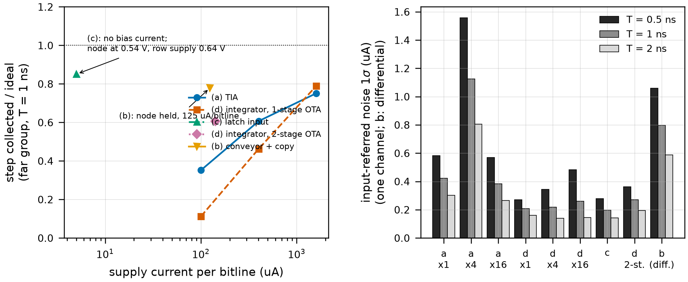
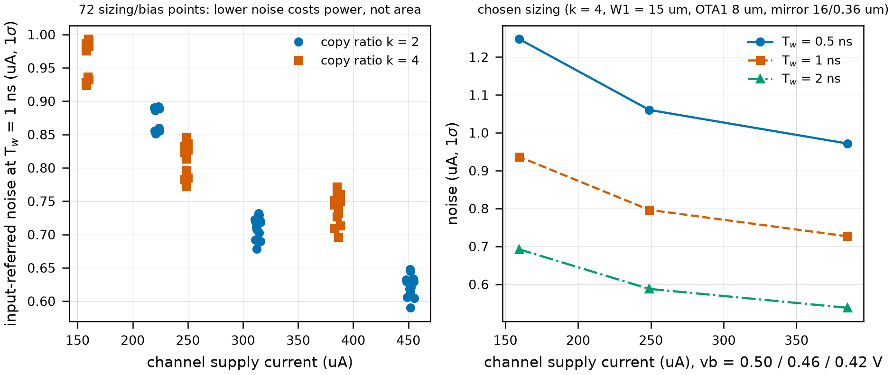
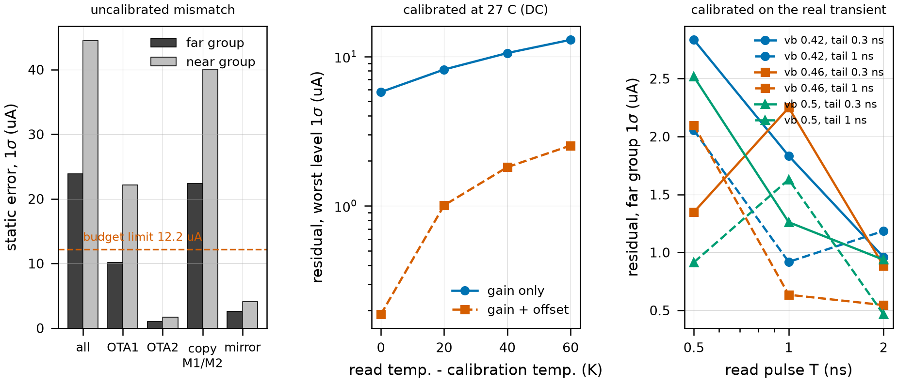
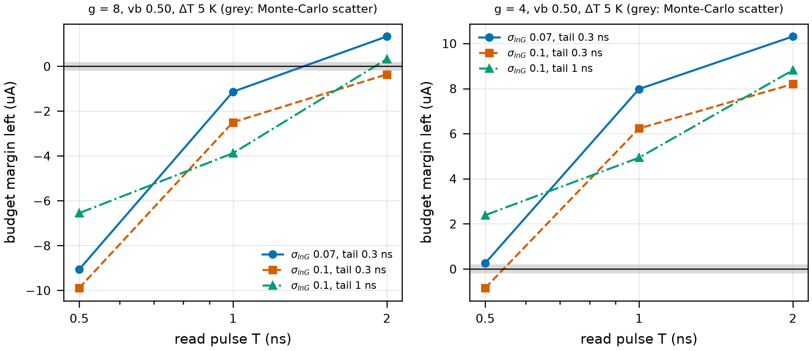
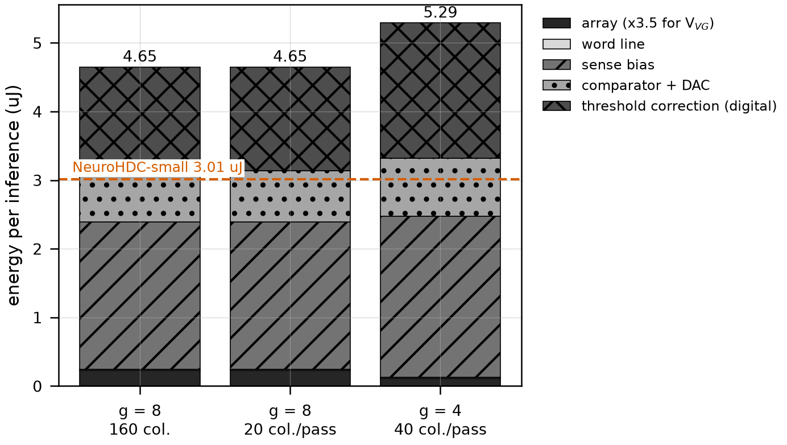
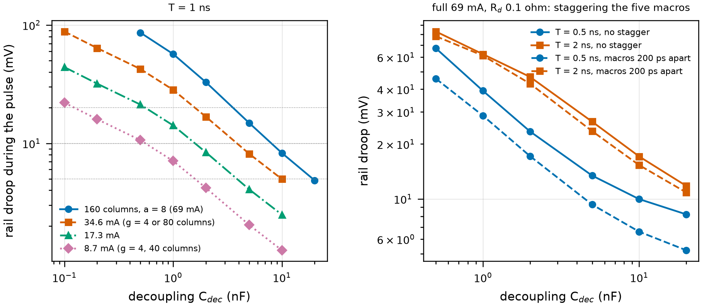
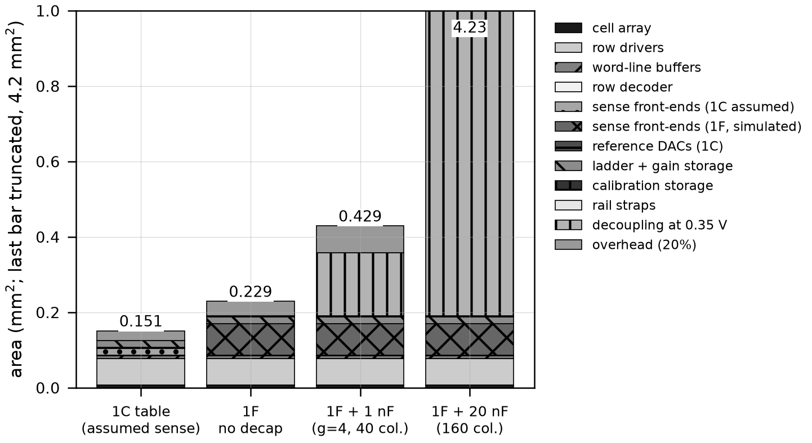
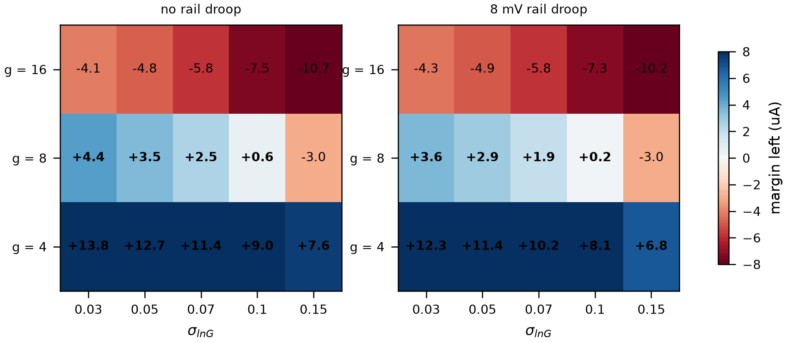

# Phase 1F report - the sense front-end and the read timing budget

Tags: **[SIM]** simulated (ngspice, PTM 45 nm LP card, transistor level), **[MODEL]** analytic in code, **[ASSUM]** assumed (listed in section 11 and swept where it matters), **[CHOICE]** design decision, **[SP]** Stanford-PKU default. Every number below is read from a JSON file by `python -m sense.make_report`; commands in section 12. Carried forward from 1C and **not** re-derived: g = 8, 64 groups, 20 F^2 cell, drivers at both ends of every 32-cell macro row, rails <= 0.0072 ohm/pitch fed from both ends, all 160 columns sensed at once, 53,590 reads of which 20,420 non-zero, array settling 130-160 ps, far-group step 30.49 uA (limit 12.20 uA, margin 0.48 uA).

## 0. The answer

- **The 1 uA of comparator noise 1C assumed was not a noise number: the front-end's error is dominated by mismatch, not thermal noise.** Device-level thermal + flicker noise of the chosen front-end is 0.80 uA (1 sigma, T = 1 ns) differential [SIM]; the comparator stage adds 0.52 uA at T = 1 ns [SIM + ASSUM latch]. But with ordinary Pelgrom mismatch (2.5 mV um [ASSUM, 1A]) the uncalibrated static error of a column is **24 uA (far group) / 44 uA (near) 1 sigma against a 12.2 uA limit**: the copy gain of each channel is 12% (1 sigma) and the amplifier offset (5.3 mV) acts on up to 1.8 mS of array conductance. **A per-column two-parameter calibration is mandatory**; after it 0.19 uA is left on DC currents and **0.5-2.8 uA on the real read transient** (far group, depending on pulse length and bias), and it goes stale at 0.04 uA per kelvin. Sections 3-4.
- **Topology: (b), a regulated current conveyor with a 1:4 copy into a charge integrator, is the only candidate that holds the virtual ground at <= 125 uA per bitline** (step collected 0.78 of ideal, far group, T = 1 ns). The TIA (a) and the bitline integrator (d) reach 0.75 / 0.79 only with the OTA scaled x16 (1.6 mA per bitline = 13x the power); the regenerative input (c) forces the node to 0.54 V (row supply 0.64 V, array energy x6.4) and collapses at the near group (0.59). (a), (c), (d) are *quieter* (0.14-0.6 uA per channel; only (a) at x4 peaks, 1.1-1.6 uA, a closed-loop peaking not investigated) - the choice is a virtual-ground / power choice, not a noise choice. Section 2.
- **Pulse length is derived, and it is set by the front-end's noise and calibration residual, not by any settling term.** g = 8: **T = 2 ns** (tail 0.3 ns); g = 4: **T = 1 ns**. The array needs 0.13-0.16 ns, the supply recovers in <= 3 ns when damped and decoupled (inside the 10 ns cycle), the conveyor's own settling is inside the calibration residual. Section 4.
- **Energy per inference with the front-end: 4.65 uJ at g = 8 and 5.29 uJ at g = 4 - 1.54x and 1.76x NeuroHDC-small's 3.01 uJ.** The array is 0.23 uJ of it (x3.5 because the sense node must sit at 0.25 V: the row supply is 0.35 V, not 0.1 V); the sense bias is 2.15 uJ, the comparators 0.75, the digital threshold correction 1.51. **1C's 32-48 nJ was the cheap part.** Exclusions as in 1C: HDC class-vector reads, 1E logic, clock tree. Section 4.
- **Charge delivery: the short pulse is NOT deliverable at full width.** 160 columns at a = 8 draw 69 mA: 10 mV of droop needs 10 nF at T = 1 ns (1.2-2.0 mm^2 at the 0.35 V rail's measured 5-8 fF/um^2) against a 0.15 mm^2 array, and with R_pad = 0.5 ohm the decoupling does not recharge in the 10 ns cycle. **Sensing 40 columns per pass at g = 4 (peak 8.7 mA) needs 1 nF (0.12-0.20 mm^2, 0.17 at the 6 fF/um^2 mid value; 7 mV droop, 3 ns recovery).** Staggering the five macros saves 37% of the decoupling at T = 0.5 ns, 27% at 1 ns and 17% at 2 ns (for 20 mV): **no**. Section 5.
- **g: 8 or 4? Honest design point: g = 4.** With the measured front-end terms, rail droop of the 1 nF decoupling and a 5 K recalibration window, g = 8 closes only for sigma_lnG <= 0.07 (margin +0.73 uA at T = 2 ns) and **fails at 0.10 (-0.76 uA)**; g = 4 closes through 0.15 (+5.17 uA at 0.10, +1.91 at 0.15). g = 16 closes nowhere with end-sensed columns; with 4-8 sense nodes per column (seg4/seg8_mid) it opens for sigma_lnG <= ~0.045 (C4's 0.048 sits on the edge: +0.04 uA). g = 4 costs 28,476 non-zero reads (x1.39) and, with the supply limit of section 5 (40 columns per pass), **522,933 cycles with the a = 0 skip against 1C's 462,618: +13%** (437,504 if all 160 columns could be sensed at once). Section 8.
- **Area: 0.229 mm^2 without decoupling (1C table 0.151), 0.429 mm^2 with the 1 nF; the real sense periphery is 0.084 mm^2 (1C assumed 0.022).** Section 7.
- **Not completed, stated plainly (details in sections 11 and 12):** the comparator latch and the threshold generator are not simulated at transistor level (ngspice has no periodic noise; the latch noise is an assumption, the threshold generator is costed, not designed); autozero was evaluated as circuit pieces, not built into the loop (the calibration replaces it, see 3.4); chopping / dynamic element matching were built and **failed** (3.6); the calibration procedure itself (reference cells, 1D) and the recalibration trigger are open; the two-stage integrator (d) was not optimised.

## 1. What 1F measures, and how it differs from the brief

1C left two things open: the **5.00 uA of the 11.72 uA error budget that was an assumed 1 uA (1 sigma) comparator noise**, and the **read pulse length T**, which sets the energy (linear in T) and which no stage had designed. 1F builds the sense chain at transistor level on the same PTM 45 nm LP card (the NMOS block from 1A; the PMOS block was added to `device/ptm/ptm45p_lp.lib`) and derives T.

**The array as the front-end sees it** (`sense/port.py`): the V_read source -> parallel branches (R_tx + R_LRS = 1558 ohm or R_tx + R_HRS) -> half the bitline capacitance -> bitline wire (0.72 ohm/pitch x distance) -> sense node. Linear at 0.1 V (1A), so ReRAM = fixed resistor [CHOICE per the brief; no compact model]. It reproduces 1C's mesh: far-group worst step 34.3 uA vs 34.1 (before row-line/rail losses). Far group = nearest row 505 pitches from the sense node; near group 1 pitch. The same row pulse drives every candidate.

**Deviations / decisions to check:**

1. **Report location**: `results/reports/phase1f_report.md` (the 1A-1C convention), not `results/1f/`; raw results in `results/sense_frontend/` and `results/pdn/`; figures in `results/figures/` (fig14-fig21).
2. **The sense node cannot sit at ground.** A PMOS-input amplifier (the only kind that works with its input near 0 V in this process) needs the node at **V_VG = 0.25 V**; the row supply must then be V_VG + V_READ = 0.35 V. The array current is unchanged (I = V_READ x G) but its energy is x3.5 against 1C's 0.1 V. This is a property of the process, not of the topology (candidate (c) is worse: 0.54 V).
3. **Static mismatch, not noise, is the dominant error** and it forces a per-column calibration that 1C did not have. Everything that follows (energy, g) depends on it.
4. The 1C margin (0.48 uA) is a Monte-Carlo estimate of a quantity with scatter: the same budget at 500 / 1000 / 2000 / 4000 draws gives 0.48 / 0.55 / 0.54 / 0.49 uA. **Margins below ~0.15 uA are not distinguishable from zero** and are marked as such.

## 2. F1 - topology: four candidates on the same step

`sense/run_topologies.py`, `results/sense_frontend/topology_comparison.json`, Figure 14. Each candidate is a transistor-level single-bitline channel; (b) is the full differential channel. The measurement is the same for all: the charge the **array delivers into the node over the read window** (T + 0.3 ns tail) divided by what an ideal virtual ground (node held at V_VG) would draw from the same transient, as the differential step (BL+ minus BL-) over m = 1, 3, 5, 7 matching rows - far group (30.49 uA step) and near group (123 uA). A candidate that cannot hold the node does not just lose signal, it makes the loss data-dependent.

| candidate | supply per bitline (uA) | forced node (mV) | step vs ideal, far, T 0.5 / 1 ns | near, T 1 ns | node excursion far (mV) | noise 1 sigma (uA) at T 0.5 / 1 / 2 ns |
|---|---|---|---|---|---|---|
| (a) TIA, R_f 500 ohm, 1-stage OTA | 100 | 255 | 0.35 / 0.35 | 0.23 | 194-270 | 0.58 / 0.42 / 0.30 |
| (a) OTA x4 current | 401 | 259 | 0.58 / 0.61 | 0.49 | 227-268 | 1.56 / 1.13 / 0.81 |
| (a) OTA x16 | 1604 | 262 | 0.72 / 0.75 | 0.63 | 197-345 | 0.57 / 0.38 / 0.26 |
| (d) integrator on the bitline, C_f 1 pF, 1-stage OTA | 100 | 250 | 0.12 / 0.11 | 0.04 | 274-324 | 0.27 / 0.21 / 0.16 |
| (d) OTA x4 | 401 | 250 | 0.48 / 0.46 | 0.26 | 258-292 | 0.34 / 0.22 / 0.14 |
| (d) OTA x16 | 1605 | 250 | 0.85 / 0.79 | 0.58 | 221-267 | 0.48 / 0.26 / 0.14 |
| (d) two-stage Miller OTA (open-loop ~60 dB) | 142 | 250 | 0.53 / 0.61 | 0.38 | 249-320 | 0.36 / 0.27 / 0.19 |
| (c) latch input device (regenerative) | -0 | 542 | 0.98 / 0.85 | 0.59 | 501-554 | 0.28 / 0.20 / 0.14 |
| (b) conveyor + 1:4 copy + integrator (differential channel) | 124 | 250 | 0.67 / 0.78 | 0.81 | 211-334 | 1.06 / 0.80 / 0.59 |

**Input impedance** of (b) with the array removed and 100 uA flowing: 33 ohm at 100 MHz, 147 at 500 MHz, 325 ohm at 1 GHz (inductive: the loop gain runs out). Against the ~195 ohm of eight LRS branches in parallel this is why the node is pushed 40 mV below and 85 mV above V_VG (211-334 mV) during a 0.5-1 ns pulse and why the collected step is 0.67-0.78, and why longer pulses help: the signal bandwidth (~0.5/T) must stay below ~300 MHz. **Ground rails** (`ground_rise.json`): raising the local ground of the sinks by 3 mV (1C measured 1.8 mV far / 3.2 mV near in a macro) changes the differential by at most 0.16 uA (far) / 0.60 uA (near), the node by 0.12 mV; 5 mV: 0.26 / 1.00 uA. The node is regulated against an absolute reference, so the 69 mA in the ground rails is benign if V_ref is distributed without current; the shift is deterministic given (G, a), i.e. inside the table.

**Common-level shift (2-22 uA, 1C).** (b): a current added to both bitlines leaks into the differential by the common-mode gain measured here: 0.7% far / 1.3% near nominal (CMRR 43 / 38 dB) - after the PMOS mirror was matched to the summing node (V_S = 0.45 V, 16/0.36 um; at 0.6 V and 4/0.09 um it was 6.5%) - **but 14% (1 sigma) with mismatch**, i.e. 17 dB. **The CMRR the 1B check requires** (common-mode error held to 10% of a step): g = 4 23 / 20 dB, g = 8 32 / 26 dB, g = 16 41 / 32 dB (far / near). The nominal channel meets all of them (g = 16 far by 2 dB); a column with uncalibrated mismatch meets none; the calibrated one (residual gain mismatch ~0.1%, 60 dB) meets all. For (a), (c), (d) the common level only moves an output by a few tens of mV (20 uA x R_f or x T/C_f) - not a limit.

**Why (b), and what the comparison does not prove.** At the same row load (b) is the only candidate whose node is held to 100-125 mV and whose step is >= 0.67 at ~125 uA per bitline; its second stage is the sink transistor M1 (g_m 1-3 mS), which a single-stage OTA cannot imitate without 13-16x the current. The cost of (b) is exactly what the tables show: 4-10x the thermal noise of (a), (c), (d), and a copy device whose mismatch the other candidates do not have. The two-stage integrator (d) has *no copy mismatch* and 0.27 uA of noise: its virtual ground is not yet good enough (0.61 far, 0.38 near) and a fixed bias leaves its output at the rail for most mismatch draws (the open-loop gain of 60 dB turns a 3 mV offset into 3 V): a real design needs a reset/autozero phase and bias centring that were not built. **It is the alternative to revisit if (b)'s calibration cannot be made to work.**



*Figure 14.* Left: differential step collected / ideal (far group, T = 1 ns) against supply current per bitline; (a) and (d) climb with OTA current and reach (b)'s step only at 13-16x its power. Right: input-referred noise by candidate and window.

## 3. F2 - noise, offset, calibration, comparator

### 3.1 Noise of the whole differential channel (device level)

`sense/mc.py: noise`, `sense/sweep_b.py` (72 sizing points), `sweep_b.json`, Figure 15. ngspice `.noise` of the whole channel - both conveyors, the copies, the mirror, the summing node, and the **array's resistors** (thermal) - integrated over the window T_w of an ideal integrate-and-dump (sinc^2 weight on the output noise that reaches the integrator, divided by the channel's DC transfer; thermal + 1/f + gate/bulk resistance noise of every BSIM4 device). Referred to the ideal array current through the collected-charge ratio eta (the signal that actually arrives).

| OTA bias vb (V) | channel supply (uA) | sigma at T_w 0.5 ns | 1 ns | 2 ns | step vs ideal (min m), T 0.5 / 1 ns | gate area (um^2) | CM gain (%) |
|---|---|---|---|---|---|---|---|
| 0.42 | 385 | 0.97 | 0.73 | 0.54 | 0.76 / 0.85 | 28 | 0.70 |
| 0.46 | 249 | 1.06 | 0.80 | 0.59 | 0.67 / 0.78 | 28 | 0.73 |
| 0.5 | 159 | 1.25 | 0.94 | 0.69 | 0.44 / 0.65 | 28 | 0.77 |

Sweep result: over k in {2, 4}, W1 in {8, 15} um, OTA1 width {8, 16} um, mirror {4/0.09, 8/0.18, 16/0.36} um and vb in {0.42, 0.46, 0.50} V the noise at T_w = 1 ns spans 0.59-0.99 uA. **It is set by the bias current (gm) and the copy ratio k, not by area**: the OTA input width and the conveyor width change it by < 3%; k = 2 instead of 4 lowers it by ~15% at +65 uA; the mirror size sets the common-mode gain (0.7% at 16/0.36 um, 2.5% at 4/0.09). Chosen sizing: k = 4, W1 = 15 um (L = 45 nm), M2 = W1/k, cascode 2 W1/k, OTA 8/0.09 um pair, mirror 16/0.36 um, V_S = 0.45 V.

**Is the noise above or below 1 uA?** Thermal + flicker alone (referred to the ideal current, T_w = T + 0.3 ns): 2.4 / 1.3 / 0.8 uA at T = 0.5 / 1 / 2 ns (vb 0.50); 1.5 / 1.0 / 0.7 at vb 0.46. **Above 1 uA below T ~ 1.5 ns, below it beyond, and the comparator and the calibration residual come on top (3.3, 3.4).**



*Figure 15.* Left: all 72 points, noise at T_w = 1 ns against channel supply current (two copy ratios); right: the chosen sizing against bias and window.

### 3.2 Static mismatch: it is large, and it is the copy device

`sense/run_mismatch.py`, `mismatch_mc.json`. Pelgrom Vth mismatch (sigma = AVT / sqrt(W L), AVT = 2.5 mV um [ASSUM, 1A]) on every transistor of the channel through BSIM4 `delvto`, N = 80 draws, differential input-referred current error of a read (sample - nominal), mean over m = 1, 4, 7 (1 sigma, uA):

| mismatched devices | far group | near group |
|---|---|---|
| all | 23.9 | 44.5 |
| regulating amp OTA1 | 10.1 | 22.2 |
| cascode amp OTA2 | 1.0 | 1.7 |
| copy devices M1/M2 | 22.4 | 40.1 |
| PMOS mirror | 2.6 | 4.1 |

The copy devices dominate: with M1 and M2 of different size in weak-to-moderate inversion the copy current error is gm x dVth(M2) (k times larger when referred back to the array). The error does not shrink with a smaller W1 (2-15 um: 22-30 uA far) and grows with k (23 -> 40 uA for k = 2 -> 8 at W1 = 4 um): in triode, g = I/V_ds is fixed by the current to be carried, so delta-g/g = dVth/V_ov; only a deep-triode device (V_ov ~ 0.6 V) would lower it, and that needs a much higher-gain amplifier than the single-stage OTAs used here to hold the node (not built). **Uncalibrated, no sizing of this topology reaches the 12.2 uA limit.**

### 3.3 Calibration: two parameters per channel, then what is left

`sense/cal.py`, `calibration_mc.json`, `calibration_transient.json`, Figure 16. The whole static error of a column is described by two numbers per channel: the **effective gain** kappa (sigma 12%) and the **node offset voltage** V (error V x G_array(state)); they are nearly collinear (I_nom ~ 0.1 V x G_array), separated only by the few-percent group-to-group variation of the front-end gain, so V is carried on the orthogonal component. A calibration measurement with known cells (both groups, m = 0..8) fits them; the column is then corrected with them. Residual (far group, worst level, 1 sigma, N = 100 draws):

Uncalibrated rms error 38 uA.

| read temperature (C), calibrated at 27 C | gain only: worst level (uA) | gain + offset: worst level (uA) | gain + offset: rms (uA) |
|---|---|---|---|
| 27 | 5.78 | 0.19 | 0.11 |
| 47 | 8.17 | 1.01 | 0.68 |
| 67 | 10.54 | 1.82 | 1.30 |
| 87 | 12.92 | 2.53 | 1.88 |

**Trim resolution** (parameters rounded to +/- 4 sigma in 2^bits steps, DC, 27 C): 6 bits (kappa LSB 1.55%) -> 2.38 uA, 8 bits (kappa LSB 0.39%) -> 0.52 uA, 9 bits (kappa LSB 0.19%) -> 0.32 uA, 10 bits (kappa LSB 0.10%) -> 0.21 uA, 12 bits (kappa LSB 0.02%) -> 0.19 uA. **10 bits** per parameter is where the quantisation stops mattering.

**On the real read transient** (the calibration is done with the read pulse itself; far group, worst level; N = 40 draws, scatter of this statistic ~15%):

| vb (V) | tail (ns) | T = 0.5 ns | T = 1 ns | T = 2 ns |
|---|---|---|---|---|
| 0.42 | 0.3 | 2.83 (6.9) | 1.83 (6.4) | 0.96 (6.4) |
| 0.42 | 1 | 2.05 (6.4) | 0.92 (6.2) | 1.18 (6.1) |
| 0.46 | 0.3 | 1.35 (6.6) | 2.25 (6.4) | 0.88 (6.1) |
| 0.46 | 1 | 2.10 (7.1) | 0.63 (6.4) | 0.54 (6.3) |
| 0.5 | 0.3 | 2.52 (7.0) | 1.26 (5.9) | 0.94 (5.4) |
| 0.5 | 1 | 0.91 (8.8) | 1.63 (6.0) | 0.46 (5.4) |

(in brackets: one gain per channel only). **The transient residual (0.5-2.8 uA) is 5-15x the DC one**: mismatch also changes how each channel settles after the pulse starts (the node excursion and the conveyor's start-up depend on the offsets), and a two-parameter static model does not follow that. It falls with T and with the integration tail, which is the first reason T cannot be short.



*Figure 16.* Left: static error by mismatch source (budget limit 12.2 uA). Centre: calibrated at 27 C on DC currents, read at another temperature. Right: calibrated on the real transient, far group, vs pulse length, bias and tail.

**Temperature.** The calibration goes stale at ~0.04 uA per kelvin (worst level, 1 sigma: 1.0 uA at +20 K, 2.5 at +60 K). By source (`drift_by_source.json`, +40 K): copy devices 1.9 uA, OTA1 0.48, OTA2 0.42, mirror 0.05: **it is the weak-inversion gain of the copy devices (error ~ dVth / (n kT/q)), not the amplifier offset.** Scaling the gain deviation with 1/T made it worse (the fitted kappa is not 1 + epsilon: it carries the offset compensation). **Operating requirement: recalibrate when the temperature has moved by more than ~5 K (0.25 uA at 1 sigma); how, and what it costs, is not designed (TBD).**

### 3.4 Offset cancellation: autozero evaluated, not adopted

`sense/az.py`, `autozero.json`. OTA1's input offset is 5.3 mV (1 sigma, N = 200 [SIM]) = 9.4 uA on the far group's 1.78 mS and 27 uA on the near group's 5.05 mS. An autozero loop (OTA in unity feedback, offset stored on C_az, transmission gate) was simulated: **cost in time** = settling of the stored value to 0.1 mV: 1.4 ns at C_az = 0.3 pF, 7.4 ns at 1 pF (hidden in the 10 ns cycle if prefetched during the previous decision); **residual** = switch charge injection (W = 1 um: 0.47 mV at 0.3 pF, 0.18 mV at 1 pF; systematic, so calibratable, with a random fraction of ~20% [ASSUM]) and kT/C (118 uV at 0.3 pF = 0.21 uA far, 0.59 uA near): ~0.25 uA. **Not adopted**: the offset's temperature drift is 0.17 uA at +20 K against 1.0 uA for the copy gain (3.3), and the per-column calibration already removes its static part; autozero would cost 2 x 160 capacitors and 1.4-7 ns per read for the smaller half of the drift. Revisit if the recalibration window cannot be met.

### 3.5 The comparator stage

`sense/comparator.py`, `comparator_noise.json`. The charge Q+ - Q- - Q_thr integrates on C_int = 200 fF (sized so the node swings <= 0.3 V for the largest |I - threshold| of the near group); the sign of V(S-) - V(S+) is read by a clocked comparator. ngspice has **no periodic or transient device noise**, so the comparator is split: (i) the **preamplifier at device level**: PMOS-input OTA, W = 32 um, 35x gain; at W = 32 um its input noise is 0.61 mV over a 0.3 ns amplification window (1.9 mV for the 8 um version, 0.45 mV at 128 um: flicker floor), 51 uA while active; (ii) the **latch behind it, not simulated**: sigma_latch = 1 mV [ASSUM] divided by the preamp gain (0.03 mV); (iii) **reset noise** sqrt(2 kT/C) = 203 uV on the two integrators, exact. Referred to the array current, sigma_I = sigma_V x C_int x k / T: **1.03 / 0.52 / 0.26 uA at T = 0.5 / 1 / 2 ns** - at 0.5 ns the comparator alone already uses the whole 1 uA 1C allowed for everything. The comparator's static offset (a 10 mV class latch [ASSUM] = 8 uA at T = 1 ns) is one more per-column number removed by the calibration; its residual is assumed inside the calibration terms (an [ASSUM]).

### 3.6 Chopping and element swapping: built, failed

`sense/b2.py`, `sense/dem.py`, `sense/run_chop.py`, `chopping_negative.json`. To cancel the copy gain without calibration, the conveyors were swapped between the bitlines half-way through the window (dual integrator S+ / S-, no mirror), and separately the copy devices were swapped (dynamic element matching). Nominal circuit, far group, differential step / ideal: dual integrator **plain 0.94, chopped -0.42 at T = 0.5 ns** (the swap lands before the conveyors have re-slewed), 0.89 -> 0.92 at 1 ns, 0.91 -> 0.70 at 2 ns; DEM of the copy devices 0.31 -> 0.07 (1 ns). With mismatch (T = 1 ns, N = 30): raw error 49 uA plain vs 27 uA chopped (halved, not removed), and after a gain per channel 4.5 uA plain vs **16.7 uA chopped**: the swap adds mismatch-dependent settling errors that calibration cannot follow. Conveyors that must re-slew from a 2-3x different current need more than the ~0.5 ns the window leaves. Negative result, kept.

## 4. F3 - the pulse length, derived

A read has four time scales; the pulse length is the largest of what each demands:

| term | demand | source |
|---|---|---|
| array settling (bitline RC, row line) | 0.13-0.16 ns to 0.1 uA; crosstalk < 0.1 uA from ~150 ps | 1C [SIM] |
| supply (rail ring-down after the pulse) | recovery to 1 mV in 3.0 ns for the recommended 8.7 mA / 1 nF; 10-30 ns for the full 69 mA with 10-20 nF (> the 10 ns cycle) | `sense.pdn` [SIM] |
| power-up of the bias | 1.0 / 1.8 / 3.2 ns for vb 0.42 / 0.46 / 0.50 (idle 325 / 188 / 99 uA): before the pulse, overlappable with the previous decision | `sense.enable` [SIM] |
| **front-end noise + calibration residual** | **sigma_total <= what the budget allows** (below) | sections 3.1-3.5 |

The budget allows (all else at 1C values, MC n = 200): g = 8, sigma_lnG 0.05: 1.79 uA, g = 8, sigma_lnG 0.07: 1.59 uA, g = 8, sigma_lnG 0.1: 1.03 uA, g = 4, sigma_lnG 0.1: 3.54 uA, g = 4, sigma_lnG 0.15: 3.00 uA (the single front-end 1 sigma that the budget tolerates, 5 sigma in quadrature). The measured front-end sigma (thermal, comparator, calibration residual, drift, threshold generation in quadrature, far group) is:

| T (ns) | tail (ns) | thermal | comparator + reset | calibration residual | drift (5 K) | threshold gen. [ASSUM] | total sigma (uA), vb 0.50 |
|---|---|---|---|---|---|---|---|
| 0.5 | 0.3 | 2.41 | 1.03 | 2.52 | 0.25 | 0.17 | **3.65** |
| 1 | 0.3 | 1.32 | 0.52 | 1.26 | 0.25 | 0.17 | **1.92** |
| 1 | 1 | 1.46 | 0.52 | 1.63 | 0.25 | 0.17 | **2.27** |
| 2 | 0.3 | 0.83 | 0.26 | 0.94 | 0.25 | 0.17 | **1.31** |
| 2 | 1 | 0.90 | 0.26 | 0.46 | 0.25 | 0.17 | **1.09** |

**The binding term** (g = 8, sigma_lnG 0.07, vb 0.50, tail 0.3 ns, 5 K): margin left when only one front-end term is present (`binding` below), and with all of them:

| T (ns) | no 1F term (1C only) | + thermal & comparator noise only | + calibration residual only | all 1F terms |
|---|---|---|---|---|
| 0.5 | +4.29 | -4.28 | -3.79 | -9.08 |
| 1 | +4.29 | +0.92 | +1.51 | -1.15 |
| 2 | +4.29 | +2.83 | +2.63 | +1.32 |

At T = 0.5 ns the noise alone costs 8.6 uA; at 2 ns the calibration residual is the larger term. **g = 8 closes only at T = 2 ns (margin +0.73 uA at sigma_lnG 0.07 including the droop); g = 4 closes already at 1 ns** (tail 0.3 ns; the limit of 19.5 uA at the far group is looser). Where the pulse length is *derived* from: noise + calibration residual (set by the conveyor's loop bandwidth, 3.3), not the array (0.15 ns) and not the supply (recovers inside the cycle when the supply is damped and the current is limited, section 5). Figure 17.



*Figure 17.* Margin left against T (vb 0.50, 5 K recalibration window, no droop). Grey: Monte-Carlo scatter of the budget (~0.15 uA).

### Energy per inference at that T

`sense/energy_1f.py`, `energy_per_inference_1f.json`, Figure 20. 1E's real read pattern with the a = 0 reads skipped (20,420 non-zero reads at g = 8, 28,476 at g = 4; mean 2.24 / 1.61 active rows). Components: array = 1C's table x (V_VG + V_READ)/V_READ = 3.5 [SIM x MODEL]; word line 16 nJ (1C); **sense bias** = 160 columns x 1.1 V x (I_idle x (t_en + T + tail) + I_signal x (T + tail)) per non-zero read, the front-end powered only for its own read [SIM]; **comparators** = preamp 51 uA x 1.1 V x 0.3 ns + latch 10 fJ + threshold capacitor-array 100 fJ per comparison [SIM + ASSUM], binary search over the a + 1 outcomes (mean 1.8 comparisons at g = 8); **threshold correction** = the 32-position digital rank-3 correction (section 7) at Horowitz ISSCC 2014 45 nm op energies [ASSUM, cited].

| g | vb | T + tail (ns) | array (uJ) | sense bias | comparators | threshold corr. | total (uJ) | vs 3.01 uJ |
|---|---|---|---|---|---|---|---|---|
| 4 | 0.42 | 0.5 + 0.3 | 0.06 | 2.96 | 0.85 | 1.97 | **5.85** | 1.94x |
| 8 | 0.42 | 0.5 + 0.3 | 0.06 | 2.14 | 0.75 | 1.51 | **4.47** | 1.48x |
| 4 | 0.42 | 1 + 0.3 | 0.11 | 3.81 | 0.85 | 1.97 | **6.76** | 2.25x |
| 8 | 0.42 | 1 + 0.3 | 0.11 | 2.77 | 0.75 | 1.51 | **5.15** | 1.71x |
| 4 | 0.42 | 2 + 1 | 0.23 | 6.72 | 0.85 | 1.97 | **9.78** | 3.25x |
| 8 | 0.42 | 2 + 1 | 0.23 | 4.89 | 0.75 | 1.51 | **7.39** | 2.46x |
| 4 | 0.46 | 0.5 + 0.3 | 0.06 | 2.51 | 0.85 | 1.97 | **5.40** | 1.79x |
| 8 | 0.46 | 0.5 + 0.3 | 0.06 | 1.82 | 0.75 | 1.51 | **4.14** | 1.38x |
| 4 | 0.46 | 1 + 0.3 | 0.11 | 3.02 | 0.85 | 1.97 | **5.97** | 1.98x |
| 8 | 0.46 | 1 + 0.3 | 0.11 | 2.20 | 0.75 | 1.51 | **4.58** | 1.52x |
| 4 | 0.46 | 2 + 1 | 0.23 | 4.77 | 0.85 | 1.97 | **7.83** | 2.60x |
| 8 | 0.46 | 2 + 1 | 0.23 | 3.49 | 0.75 | 1.51 | **5.99** | 1.99x |
| 4 | 0.5 | 0.5 + 0.3 | 0.06 | 2.05 | 0.85 | 1.97 | **4.94** | 1.64x |
| 8 | 0.5 | 0.5 + 0.3 | 0.06 | 1.49 | 0.75 | 1.51 | **3.82** | 1.27x |
| 4 | 0.5 | 1 + 0.3 | 0.11 | 2.34 | 0.85 | 1.97 | **5.29** | 1.76x |
| 8 | 0.5 | 1 + 0.3 | 0.11 | 1.71 | 0.75 | 1.51 | **4.09** | 1.36x |
| 4 | 0.5 | 2 + 1 | 0.23 | 3.33 | 0.85 | 1.97 | **6.39** | 2.12x |
| 8 | 0.5 | 2 + 1 | 0.23 | 2.46 | 0.75 | 1.51 | **4.96** | 1.65x |

1C's numbers (array + word line only, V_READ 0.1 V): 0.5 ns: 32 nJ, 1 ns: 48 nJ, 10 ns: 340 nJ. **The recommended points are 4.65 uJ (g = 8, T = 2 ns) and 5.29 uJ (g = 4, T = 1 ns), 1.54x and 1.76x NeuroHDC-small (3.01 uJ, whole accelerator at 45 nm).** Per non-zero read: 228 pJ (g = 8), 186 pJ (g = 4); per column and read the sense front-end costs 0.66 pJ. **Named exclusions:** class-hypervector reads and HDC logic (Phase 2), 1E's flip-flops and clock tree, the supply regulator and the energy of the calibration. **This comparison is unfavourable by construction in one respect: NeuroHDC counts a whole accelerator; ours is the weight memory and its periphery only.** The front-end energy is a trade of power against noise at fixed T (sigma^2 ~ 1/(gm T) and E ~ gm T): at the noise the budget allows, ~1 pJ per column and read is the floor this topology reaches; boosting the bias during power-up (the 1.0-3.2 ns idle ramp is a third of the on-time) was not designed.



*Figure 20.* Energy per inference for the three architectures of section 5 (vb 0.50; g = 8 at T = 2 ns, g = 4 at T = 1 ns), by component, against NeuroHDC-small's 3.01 uJ.

## 5. F4 - power delivery of the read pulse

`sense/pdn.py`, `results/pdn/pdn_sweep.json`, `pdn_pad_sweep.json`, Figure 18. Lumped ngspice model of the row-supply rail (0.35 V): regulator (ideal source behind R_reg 0.05 ohm and L_reg 0.5 nH, a ~16 MHz loop that cannot follow a nanosecond pulse and only recharges between reads) [ASSUM] -> package R_pad 0.5 ohm, L_pad 100 pH (the brief's baseline) -> rail wire 0.1 ohm [MODEL, 1C rails] -> on-chip decoupling C_dec with a series damping resistor R_d; the load is five current pulses (one per macro) of I/5 each with 100 ps ramps (the array's own rise), width T, stagger s. **Decoupling density at this rail, from the PTM card** (a MOS capacitor C(V) AC simulation at the rail's 0.35 V): **5.0 fF/um^2** (NMOS gate at 0.35 V over ground: below threshold) to **8.2 fF/um^2** (accumulation-mode in an isolated well); 21 fF/um^2 only at 1.1 V - 1C's 10 fF/um^2 would need a MIM/MOM capacitor.

**Droop of the full 160-column read** (69.2 mA, a = 8, T = 1 ns, no stagger, R_d 0.02 ohm; `droop` = minimum rail voltage during the pulse):

| C_dec (nF) | area at 8.2-5.0 fF/um^2 (mm^2) | droop, T = 1 ns (mV) | recovery (ns) | droop, T = 2 ns (mV) | recovery (ns) |
|---|---|---|---|---|---|
| 1 | 0.12-0.20 | 56.9 | 6.1 | 65.3 | 7.6 |
| 2 | 0.24-0.40 | 32.9 | 5.7 | 48.2 | 5.7 |
| 5 | 0.61-1.00 | 14.9 | 6.5 | 24.9 | 7.3 |
| 10 | 1.22-2.00 | 8.3 | 11.6 | 14.1 | 14.8 |
| 20 | 2.44-4.00 | 4.9 | 16.2 | 7.9 | 23.8 |

Q = I T = 69 pC at 1 ns (138 pC at 2 ns): a droop budget of 10 mV costs 10 nF / 20 nF; 5 mV does not close inside 20 nF at 2 ns. **A droop of d mV scales the read bias by (1 - d / 100) and the budget's signal terms with it (an 8 mV droop costs 0.4-0.8 uA of margin at g = 8)**, so the budget, not the supply, sets the droop target. **The recovery matters as much as the droop**: through R_pad the decoupling recharges with tau = R_pad C: 10 nF with 0.5 ohm is 5 ns, the rail needs 12-24 ns to settle to 1 mV, i.e. longer than the 10 ns cycle; reads would then see the previous read's droop (history-dependent, not calibratable).

**Is the short pulse deliverable?** At full width: **no**. 0.5 ns needs 10 nF for 5 mV (1.2-2.0 mm^2, 8-13x the array); 2 ns needs 20 nF for 8 mV (2.4-4.0 mm^2) and 24 ns to recover. **At reduced peak current: yes.** Scaling the current (fewer columns per pass or smaller a per read):

| peak current | C_dec for 5 mV (nF) | 10 mV | 20 mV |
|---|---|---|---|
| 160 columns, g = 8 (69 mA) | 20 | 10 | 5 |
| 80 columns or g = 4 (34.6 mA) | 10 | 5 | 2 |
| 40 columns at g = 8 or 80 at g = 4 (17.3 mA) | 5 | 2 | 1 |
| 40 columns at g = 4 (8.7 mA) | 2 | 1 | 0.2 |

(T = 1 ns; 2 ns needs ~1.5-2x). **The recommended supply design is the last row: 40 columns per pass (4 passes), g = 4, C_dec = 1 nF (0.12-0.20 mm^2 at 8.2-5.0 fF/um^2), R_d 0.05 ohm: droop 7 mV, recovery 3 ns.** The cost is latency, not energy (each column-read costs the same whatever the pass): 522,933 cycles per inference with the a = 0 skip, against 462,618 for 1C's g = 8 / 160-column read without it, and 429,448 for g = 8 / 160 columns with it.

**Staggering the macros** (five macros 200 ps apart, peak 14 mA each): the droop falls by a factor 1.44 at T = 0.5 ns and 1.26 at 1 ns, 1.13 at 2 ns (5 nF, R_d 0.1 ohm): the decoupling saved for a 20 mV droop is 37% at 0.5 ns, 27% at 1 ns and 17% at 2 ns (2.6 -> 1.6 nF, 4.5 -> 3.2 nF, 7.8 -> 6.5 nF). The read window grows by 0.8 ns, still inside one cycle (cycle count unchanged), each macro's sense integrates its own window (energy unchanged). **Recommendation: no** - the pulse lengths 1F derives are >= 1 ns, where it saves little, and it needs five delayed timing domains.

**Damping.** The series resistance in the decoupling path costs I x R_d of droop and buys recovery: at the full 69 mA, R_d 1 ohm gives a 64 mV droop whatever the capacitance; 0.02-0.1 ohm costs 1.4-7 mV. Recovery after the pulse is set by R_pad C and the regulator's L_reg (`pdn_pad_sweep.json`, 8.7 mA / 1 nF and 69 mA / 10 nF): droop depends on C_dec (6.8-8.5 mV for the full read over R_pad 0.1-1 ohm, L_pad 50-200 pH, L_reg 0-2 nH) and hardly on the pad network; **recovery depends on L_reg**: an ideal regulator recovers in 1 ns, 0.5 nH in 4 ns, 2 nH (a ~4 MHz loop) in 16 ns. **Requirements: regulator output inductance <= 0.5 nH, R_pad C <= 1/3 of the cycle, R_d 0.05 ohm.**



*Figure 18.* Left: droop against C_dec at T = 1 ns for the four peak currents (dotted: 5, 10, 20 mV). Right: the full 69 mA with and without 200 ps stagger between macros at T = 0.5 and 2 ns.

## 6. F5 - the threshold path

`sense/threshold_path.py`, `threshold_path.json`. A column's decision is made against a threshold that depends on the group and on a; the threshold has to reach each column's comparator with 1 sigma <= ~0.2 uA out of up to 115 uA (far) / 300 uA (near) - **10-11 bits of absolute accuracy per column**, because any error of that column's threshold is an error of that column's decision.

**What matching can give** (a PMOS current mirror, the unit of every per-column current DAC or copy; Pelgrom Monte-Carlo on the card, 20 uA): 0.2 um^2: 12.34%; 0.7 um^2: 11.14%; 2.9 um^2: 3.54%; 11.5 um^2: 2.61%; 46.1 um^2: 0.82%; 184.3 um^2: 0.64%. **Even 184 um^2 per mirror leaves 0.6% (2 uA at 300 uA): per-column generation needs per-column calibration, or a structure whose accuracy comes from capacitor ratios.**

| delivery | area per column (um^2) [ASSUM] | accuracy | energy per read, 160 columns (pJ) | timing |
|---|---|---|---|---|
| A: current DAC per column | 415 | needs per-column calibration of its 10-bit gain (mirror matching alone is 1-3%) | 6 | 0.3-0.5 per comparison (DAC settling to 0.1% into the 200 fF integrator) |
| B: shared DAC + sample-and-hold per column | 60 | S&H droop and kT/C per column; the DAC is time-multiplexed: 160 values per comparison in < 1 ns is not possible -> only for 20-40 columns per pass | - | 160 x settle (>= 0.3 ns each) per comparison without multiplexing hardware |
| C: switched capacitor-array ladder per column | 250 | capacitor matching ~0.1-0.2% for 10-bit unit arrays [ASSUM], temperature-stable; the least calibration | 29 | 0.2 per step (charge redistribution) + 0.3 comparator |
| D: digital after per-column ADC | 3000 | 10-11 bit ADC INL ~ 0.5-1 LSB: needs ~12 bit | 3200 | >= 2-4 per conversion |

**Chosen for the estimates (not designed): (C) a 10-bit switched capacitor array per column**, because its accuracy is capacitor matching (~0.1-0.2% [ASSUM]) and temperature-stable; it costs ~250 um^2 per column and ~100 fJ per comparison [ASSUM]. (A) is the same function in current mode and needs the 10-bit gain calibrated per column; (B) cannot serve 160 columns in a nanosecond; (D) costs 160 ADCs x 20 pJ x 20,420 reads = 65 uJ per inference - rejected.

**Where the rank-3 row-gain multiply is done** (1C: gain(c, G, a) = sum of 3 products, 12-bit, 19,584 bits). Digital energy per inference at Horowitz op energies (12-bit multiply 0.45 pJ, 12-bit add 0.05 pJ, SRAM 0.16 pJ/bit):

| where | g = 8 (uJ) | g = 4 (uJ) |
|---|---|---|
| per column, digital (160 x (3 MAC + comparisons x multiply) per read) | 7.5 | 9.8 |
| per column POSITION, digital (the 32 distinct positions of a macro row, shared by the five macros) | 1.51 | 1.97 |
| stored corrected thresholds (one SRAM read of the needed thresholds x 32 positions per read) | 2.20 | 2.51 |

**Doing it per column costs more than NeuroHDC's whole inference (7.5 uJ).** The correction depends on the column's position inside its macro row (32 values), not on the column itself, so the five macros share it: ~1.5 uJ (g = 8) - 2.0 uJ (g = 4) [MODEL/ASSUM]; that is the figure used in section 4. Moving the correction into the analog domain (three shared 'weighted ladders' and three per-column trimmed weights) would remove it but needs three trimmed threshold paths per column: not evaluated. **This is a cost of 1C's rank-3 correction that 1C did not price; it is the second largest item after the sense bias.**

**Timing and prefetch.** The group sequence and a are known before the read (they are 1E's counts): the threshold table lookups, the digital correction and the capacitor-array pre-charge of the next read overlap the current read. A binary search needs 1.8 comparisons on average at g = 8 (1.5 at g = 4; 4 at most), each 0.2 ns (charge redistribution) + 0.3 ns (comparator): 2 ns at most, inside the 10 ns cycle with the 2 ns window and the 1.8-3 ns power-up (itself prefetchable: the next read is known). No timing term is binding. **Area:** see section 7.

## 7. Area: 1C's table re-run with the real sense periphery

`sense/area_1f.py`, `area_table_1f.json`, Figure 21. 1C assumed per column a 20 um^2 sense input and eight 12 um^2 comparators (116 um^2) plus eight 400 um^2 reference DACs. Here, per column [low-mid-high ranges as 1C]: the simulated channel's gate area (28 um^2 of W x L) x a layout factor 3 / 5 / 8; two integration capacitors of 200 fF at 20 / 10 / 5 fF/um^2; the decision stage (preamp W = 32 um, latch); the 10-bit threshold capacitor array (150 / 250 / 400 um^2); 2 x 10 calibration trim bits.

| per column (mid, um^2) |  |
|---|---|
| conveyor channel | 141 |
| integration caps | 40 |
| decision | 62 |
| threshold cap array | 250 |
| trims | 30 |
| **total** | **524** |
| 1C's assumption | 116 (+ shared DACs) |

| decoupling at 0.35 V | total low (mm^2) | mid | high |
|---|---|---|---|
| 0 nF | 0.142 | 0.229 | 0.405 |
| 1 nF | 0.288 | 0.429 | 0.645 |
| 2 nF | 0.434 | 0.629 | 0.885 |
| 20 nF | 3.069 | 4.229 | 5.205 |

1C's table: 0.151 mm^2. The sense periphery grows from 0.022 to 0.084 mm^2; the decoupling is larger than the rest of the chip for a full-width read (20 nF: 3.3 mm^2) and comparable to the array for the recommended one (1 nF: 0.17 mm^2).



*Figure 21.* Area by part: 1C's table, 1F with the simulated sense periphery and no decoupling, with the recommended 1 nF, and with the 20 nF a full-width read would need (truncated).

## 8. F6 - the budget re-closed, and g as a surface

`sense/budget_1f.py`, `sense/closure_1f.py`, `sense/recommend_1f.py`, `closure_map.json`, `recommended_designs.json`, Figure 19. The 1C machinery is unchanged (`drift.strategies.evaluate` through `scaleup.budget1c.close_1c`; S1, drift 'moderate', 20 F^2, R_s 1 ohm, 5 sigma random terms in quadrature, 20% headroom); the comparator-noise slot (1C's assumed 1 uA -> 5.00 uA) is replaced by four measured lines per group:

far-group lines at the g = 8 point (T = 2 ns, vb 0.50, sigma_lnG 0.07, 8 mV droop, 5 K), uA at 5 sigma:

| term | uA |
|---|---|
| device spread | 5.17 |
| ReRAM HRS leakage residual | 0.96 |
| wire IR (within group) | 0.49 |
| row-driver IR | 1.25 |
| supply/ground rail (data dependent) | 0.04 |
| settling + crosstalk at sampling time | 0.00 |
| ladder threshold quantisation | 0.05 |
| antisymmetric (half) table storage | 0.03 |
| row-gain correction residual (rank 3) | 0.21 |
| front-end noise (thermal + comparator + reset) | 4.35 |
| per-column calibration residual | 4.68 |
| calibration drift with temperature | 1.25 |
| threshold generation (per column) | 0.86 |
| drift | 0.27 |

limit 11.23 uA, total 10.51 uA. The 1C budget at its assumed 1 uA reproduces here as 0.476 uA of 12.20 (total 11.72), i.e. exactly 1C's 0.48 / 12.20 / 11.72.

**Margin left (uA), best of the 18 front-end points (3 biases x 3 pulse lengths x 2 tails), 5 K recalibration window; without droop, then with 8 mV droop** (Figure 19):

|  | sigma_lnG 0.03 | 0.05 | 0.07 | 0.10 | 0.15 |
|---|---|---|---|---|---|
| g = 4 | +13.8 / +12.3 | +12.7 / +11.4 | +11.4 / +10.2 | +9.0 / +8.1 | +7.6 / +6.8 |
| g = 8 | +4.4 / +3.6 | +3.5 / +2.9 | +2.5 / +1.9 | +0.6 / +0.2 | -3.0 / -3.0 |
| g = 16 | -4.1 / -4.3 | -4.8 / -4.9 | -5.8 / -5.8 | -7.5 / -7.3 | -10.7 / -10.2 |

**g = 8 closes with a real margin (> 0.15 uA, outside the Monte-Carlo scatter) only for sigma_lnG <= 0.07, and then only at T = 2 ns; at sigma_lnG = 0.10 - 1C's recommended point - it is +0.6 uA without droop, +0.2 with 8 mV: not distinguishable from zero, and negative (-0.75 uA) for the 1 nF / T = 2 ns design. g = 4 closes through 0.15 with 2-8 uA to spare. g = 16 never opens with end-sensed columns:** even the 1C terms alone leave -1.0 uA at sigma_lnG 0.03; with the front-end -4.1 uA.

**g = 16 against C4** (`g16_variants.json`; sigma_lnG <= 0.048 was C4's condition for the segmented column; vb 0.46, T = 2 ns, tail 1 ns, 5 K; margin with 1F / with the 1C terms only):

| readout variant | sigma_lnG 0.02 | 0.03 | 0.04 | 0.048 | 0.05 |
|---|---|---|---|---|---|
| end | -3.82 / -0.40 | -4.07 / -1.02 | -4.40 / -1.69 | -4.71 / -2.24 | -4.80 / -2.38 |
| centre | -0.15 / +2.66 | -0.74 / +1.64 | -1.48 / +0.54 | -2.15 / -0.37 | -2.33 / -0.60 |
| seg2_mid | +3.95 / +6.12 | +2.63 / +4.33 | +1.08 / +2.45 | -0.26 / +0.93 | -0.64 / +0.25 |
| seg4_mid | +7.18 / +8.93 | +5.05 / +6.36 | +2.68 / +3.71 | +0.04 / +0.96 | -0.66 / +0.23 |
| seg8_mid | +9.08 / +10.60 | +6.10 / +7.46 | +2.81 / +3.89 | +0.06 / +0.98 | -0.64 / +0.25 |

**g = 16 opens only with centre-tapped-or-better columns: seg4_mid / seg8_mid (4-8 sense nodes per column) up to sigma_lnG ~ 0.045**; the 1F front-end takes 1.0-1.4 uA of the 1C-only margin, which is the difference between closing at 0.048 and not (+0.04 / +0.06 uA: zero within the scatter). Each extra sense node per column multiplies the front-end area (x4-x8 of the 0.084 mm^2) while the energy per read is unchanged.

**Sensitivity: what the front-end would have to do for g = 8 at sigma_lnG 0.10** (T = 2 ns, vb 0.50, 5 K, 8 mV droop; margin left vs the calibration residual scaled):

| calibration residual | margin left (uA) |
|---|---|
| x 1 | -0.76 |
| x 0.5 | +0.11 |
| x 0.25 | +0.34 |
| x 0 | +0.41 |

A calibration twice as good (0.5 uA far on the transient) puts g = 8 at sigma_lnG 0.10 at the edge; this is the quantity to improve before giving up g = 8 (more calibration parameters, a lower-mismatch conveyor, or the two-stage integrator of section 2).

**Where it ends up.**

| design | T + tail (ns) | droop (mV) / recovery (ns) | reads | cycles (a = 0 skipped) | energy (uJ) | area (mm^2) | margin left (uA) at sigma_lnG ... |
|---|---|---|---|---|---|---|---|
| 1C baseline architecture + 1F front-end (g = 8, 160 columns at once) | 2 + 0.3 | 7.9 / 23.8 | 20,420 | 429,448 | 4.65 | 4.23 | 0.05: +1.53; 0.07: +0.73; 0.1: -0.75 |
| g = 8, 20 columns per pass | 2 + 0.3 | 8.0 / 2.9 | 163,357 | 572,385 | 4.65 | 0.43 | 0.05: +1.53; 0.07: +0.73; 0.1: -0.76 |
| g = 4, 40 columns per pass | 1 + 0.3 | 7.1 / 3.0 | 113,905 | 522,933 | 5.29 | 0.43 | 0.05: +7.60; 0.07: +6.76; 0.1: +5.17; 0.15: +1.91 |
| g = 4, 40 columns per pass, larger decoupling | 1 + 0.3 | 4.2 / 1.5 | 113,905 | 522,933 | 5.29 | 0.63 | 0.05: +8.12; 0.07: +7.24; 0.1: +5.57; 0.15: +2.16 |

**The honest design point is g = 4**, 40 columns per pass, T = 1 ns (tail 0.3 ns), OTA bias vb 0.50, 1 nF of decoupling, per-column calibration with a recalibration window of 5 K: margin +5.2 uA at sigma_lnG 0.10 (+1.9 at 0.15), 5.29 uJ per inference (1.76x NeuroHDC-small), 0.43 mm^2, 522,933 cycles. **g = 8 is the alternative only if sigma_lnG <= 0.07 is demonstrated (1D) and the calibration residual is halved**; at 1C's own 0.10 it does not close once the front-end and the supply are real. g = 16 needs seg4/seg8 columns and sigma_lnG <= 0.045.



*Figure 19.* The g surface: best margin over the 18 front-end points, 5 K recalibration window, without droop (left) and with 8 mV (right). Bold: outside the Monte-Carlo scatter (> 0.15 uA).

## 9. Handoff to Phase 5

1. **Energy per group read including the sense front-end and the threshold path** (non-zero reads only): g = 4, T = 1 ns: **186 pJ** (82 pJ sense bias, 30 comparators, 69 threshold correction, 5 array + word line); g = 8, T = 2 ns: **228 pJ**.
2. **Energy per inference at the real T**: 5.29 uJ (g = 4, T = 1 ns) / 4.65 uJ (g = 8, T = 2 ns), exclusions as named in section 4. (1C's pre-front-end 32-48 nJ is the array alone with the sense node at 0 V.)
3. **Total area with the real sense periphery**: 0.43 mm^2 (mid; 0.29-0.65) with the 1 nF decoupling, 0.23 mm^2 without; 1C's table said 0.15 mm^2.
4. **The g surface** (section 8, `closure_map.json`): g = 4 for sigma_lnG <= 0.15; g = 8 for sigma_lnG <= 0.07 with a halved calibration residual; g = 16 with seg4/seg8 columns at sigma_lnG <= 0.045.
5. **Read pattern for the 1E follow-up (RTL, not done here):** skip the a = 0 reads. 53,590 -> 20,420 reads at g = 8 and 107,179 -> 28,476 at g = 4: it removes 62% / 73% of the sense energy. With the front-end this is no longer a latency detail: a read the sequencer can see is empty would cost ~96 pJ of idle bias (160 columns, power-up + window) if it were issued with the front-end powered.
6. **Interfaces the digital side needs**: the per-column calibration words (2 channels x 2 parameters x 10 bits = 40 bits per column, 6.4 kbit), the per-(position, group, a) corrected thresholds or the shared rank-3 factors, a temperature-triggered recalibration request, 40-column pass sequencing, and the read-window timing (power-up 1.8-3.2 ns before the pulse, pulse T, tail 0.3 ns, comparisons 0.5 ns each).

## 10. Compared with what 1C and the brief expected

| 1C premise | 1F finding |
|---|---|
| 1 uA (1 sigma) comparator noise, 5.00 uA of the 11.72 uA total | thermal 0.8-2.4 uA + comparator 0.3-1.0 uA + **calibration residual 0.5-2.5 uA + drift + threshold generation**: 1.1-3.7 uA (1 sigma), i.e. 5.5-18 uA at 5 sigma from T = 2 ns down to 0.5 ns (vb 0.50, far group) |
| array energy 32 nJ at 0.5 ns | x3.5 (V_VG), plus the sense bias (2.3 uJ) and threshold correction (1.5 uJ): **4.7-5.3 uJ** |
| 8 comparators + 8 DACs per column, 116 um^2 | 524 um^2 per column (mid; 250 of it the threshold capacitor array) and no reference-DAC bank, but a per-column calibration |
| supply ideal at the pads | 69 mA x 1 ns needs 10 nF (1.2-2 mm^2) for 10 mV; the recommended 8.7 mA pass needs 1 nF |
| g = 8 closes with 0.48 uA | g = 8 closes only for sigma_lnG <= 0.07; **g = 4 is the design point** |
| (not considered) calibration | mandatory, 10-bit trims, recalibration every ~5 K |

## 11. Assumptions and open items (updated TBD list)

**Assumptions (every one tagged where used; swept where stated).**

| quantity | value | tag | where / what depends on it |
|---|---|---|---|
| AVT (Pelgrom) | 2.5 mV um | [ASSUM, 1A] | all mismatch results (3.2-3.3); scales the calibration residual and the uncalibrated error linearly |
| V_VG (sense node) | 0.25 V | [CHOICE] | forced by the PMOS-input amplifier in this process; array energy x3.5 |
| latch noise | 1 mV, / preamp gain | [ASSUM] | comparator term (small: 0.03 mV after the preamp) |
| comparator + latch offset | removed by the per-column calibration | [ASSUM] | not simulated |
| threshold generation accuracy | 0.15% of the threshold, 1 sigma | [ASSUM] | capacitor-array matching; 0.86 uA at 5 sigma, far |
| recalibration window | 5 K | [CHOICE] | calibration drift measured 0.04 uA/K, 0.05 used [SIM, rounded up]; swept 0 / 5 / 10 K in `closure_map.json` |
| autozero residual random fraction | 20% | [ASSUM] | 3.4 only; autozero not adopted |
| regulator R_reg 0.05 ohm, L_reg 0.5 nH, R_grid 0.1 ohm |  | [ASSUM] / [MODEL] | PDN; L_reg swept 0-2 nH |
| R_pad 0.5 ohm, L_pad 100 pH |  | [ASSUM, brief] | swept 0.1-1 ohm, 50-200 pH: droop insensitive |
| decoupling density at 0.35 V | 5.0-8.2 fF/um^2 | [SIM] | PTM card MOS capacitor C(V) |
| sense-area densities, layout factor 3 / 5 / 8 |  | [ASSUM] | section 7 |
| op energies (multiply, add, SRAM) | Horowitz ISSCC 2014, 45 nm | [ASSUM, cited] | threshold correction energy (1.5-2 uJ) |
| capacitor-DAC switching 100 fJ, latch 10 fJ |  | [ASSUM] | comparators 0.5-0.85 uJ |
| rank-3 gain / quantisation / antisymmetric terms at g != 8 | the g = 8 values | [MODEL] | 0.4 uA at the far group in the budget |
| PDN lumped, one regulator, no on-chip grid |  | [MODEL] | droop is a lower bound for a real grid |

**Open (not done, with what is blocked):**

- **Comparator latch noise and offset**: ngspice has no periodic/transient noise; a device-level number needs another simulator or a transient Monte-Carlo with injected noise (non-converging approach not attempted). Blocked, assumed.
- **Threshold generator at transistor level** (the switched capacitor array and its distribution to 160 columns, its settling, kT/C): costed, not designed. The 0.17% accuracy requirement is derived, not demonstrated.
- **The calibration procedure**: reference states/cells, how many reads, who stores 6.4 kbit, how the 5 K trigger is generated; the calibration measurement's own noise would add to the residual (not modelled). Depends on 1D (write/verify).
- **Column-to-column variation of the dynamic response** is inside the 'calibration residual on the transient' (N = 40 draws per point, ~15% scatter); a larger Monte-Carlo and the worst-case over all 64 groups (here: far and near, 9 levels each) would tighten it.
- **The two-stage integrator (d)** and a gain-boosted conveyor: the alternatives that could remove the copy mismatch; not optimised (section 2). **Autozero in the loop** and **boosted power-up** (1 ns instead of 1.8-3.2): not built.
- **A real PDN**: bump/grid layout, the regulator design, on-chip droop sensing; the recovery requirement (R_pad C <= 3 ns, L_reg <= 0.5 nH) is a specification, not a design. **40-column passes** change 1E's sequencer (cycle model: 409,028 + passes x reads, measured by 1E for 160 and 20 columns, extrapolated).
- **The 0.25 V sense node** and its reference distribution to 160 columns at < 0.1 mV accuracy (the node error x 1.8-5 mS is the offset current): the node is held absolutely; no on-chip reference was designed.
- Not in scope and untouched: write path / forming / program-verify (1D), RTL (the a = 0 skip is recorded for 1E), the HDC side (Phase 2), early exit (Phase 4), final PPA (Phase 5).

## 12. Files and reproduction

```
python -m sense.run_topologies          # F1: results/sense_frontend/topology_comparison.json
python -m sense.sweep_b                 # F2: 72-point sizing/bias sweep (noise, step, power, area, CM gain)
python -m sense.run_mismatch            # F2: mismatch Monte-Carlo by source, CM gain with mismatch
python -m sense.cal                     # F2: calibration (DC, vs temperature, quantisation, transient)
python -m sense.run_cal_transient       # F2: calibration residual on the transient vs vb, T, tail
python -m sense.run_drift_sources       # F2: which mismatch source makes the calibration go stale
python -m sense.az                      # F2: autozero pieces
python -m sense.comparator              # F2: preamp noise, reset noise
python -m sense.run_chop                # F2: chopping / DEM (negative result)
python -m sense.enable                  # F3: power-up and supply current
python -m sense.pareto                  # F3: noise / comparator / calibration per (vb, T, tail)
python -m sense.reads                   # read counts vs g (1E golden count vectors)
python -m sense.budget_1f               # F6: allowed sigma per (g, sigma_lnG)
python -m sense.closure_1f              # F3/F6: closure map; g = 16 variants
python -m sense.energy_1f               # F3: energy per inference
python -m sense.pdn && python -m sense.pdn --pad     # F4
python -m sense.threshold_path          # F5
python -m sense.area_1f                 # F5/F7: area table
python -m sense.recommend_1f            # F6/F7: the candidate designs end to end
python -m sense.figures                 # figures 14-21
python -m sense.make_report             # this file
python -m pytest tests/test_sense_frontend.py
```

`sense/`: `ngs.py` (ngspice harness), `cells.py` (OTAs, transmission gate), `port.py` (array port), `mc.py` (the chosen front-end: netlist, mismatch, noise, fidelity, impedance), `acnoise.py`, `metrics.py`, `topo_a/c/d/d2.py`, `collect.py`, `b2.py` and `dem.py` (the failed swaps). `device/ptm/ptm45p_lp.lib`: the PMOS block of the same PTM card.
